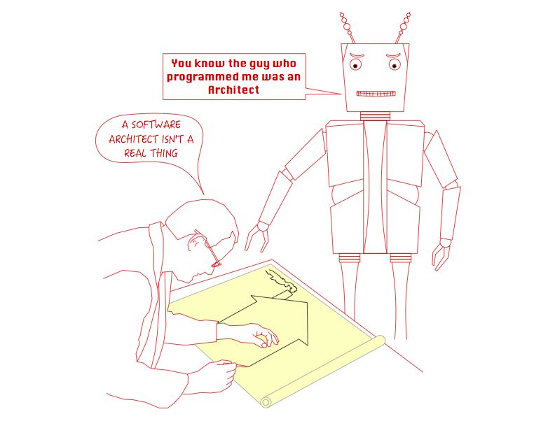

# Fundamentals of Software Architecture: Software Architecture Activities

**Author:** Kaan Keskin

Date: May 2021

Available at: https://github.com/kaan-keskin/software-architecture-notes

**Resources:**

- Clean Architecture - Robert C. Martin - 2018
- Software Architecture Lecture Notes - University of Alberta - 2017
- Code Complete 2 - Steve McConnell - 2009
- What do software architects really do? - Philippe Kruchten - 2008
- Who Needs an Architect? - Martin Fowler - 2003
- The Architecture Tradeoff Analysis Method - Rick Kazman, Mark Klein, Mario Barbacci, Tom Longstaff, Howard Lipson, Jeromy Carriere - Proceedings of ICECCS98 - July 1998
- Architectural Blueprints—The “4+1” View Model of Software Architecture from Philippe Kruchten - IEEE Software - November 1995
- Software Architecture - Wikipedia: https://en.wikipedia.org/wiki/Software_architecture

## Software Architecture Overview (recap)

**Software architecture is the fundamental design of an entire software system.** 

It defines what elements are included in the system, what function each element has, and how each element relates to one another.

**It is the big picture or overall structure of the whole system—how everything works together.**

It follows that to design a software system, a software architect has to take many factors into consideration:

- the purpose of the system,
- the audience or users of the system,
- the qualities that are of most importance to users, and
- where the system will run.

***Benefits:*** Software architecture is important, particularly for large systems. **If there is a clear design of the overall system from the start, there is a solid basis for developers to follow.** Each developer will then know what needs to be implemented and how things are related to meet desired needs efficiently. This avoids conflicts, duplication, and ad hoc unnecessary work.

**Some advantages of software architecture include:**

- **higher productivity** for the software team, as a well-defined structure helps to coordinate work, implement individual features, or guide discussions on potential issues.
- improved **evolution** for the software, since design principles are applied to make changes easier to accomplish or defects easier to find.
- enhanced **quality** in the software by carefully considering the needs and perspectives of all the stakeholders.

## Who Needs an Architect?

In most successful software projects, the expert developers working on that project have a shared understanding of the system design. This shared understanding is called **architecture**.

This understanding includes how the system is divided into components and how the components interact through interfaces. These components are usually composed of smaller components, but the architecture only includes the components and interfaces that are understood by all the developers.

This would be a better definition because it makes clear that architecture is a social construct (well, software is too, but architecture is even more so) because it doesn’t just depend on the software, but on what part of the software is considered important by group consensus.

**Architecture is about the important stuff. Whatever that is.**

## What do software architects really do?

To be successful, a software architect — or a software architecture team, collectively — must strike a delicate balance between **an external focus—both outwards: Listening to customers, users, watching technology, developing a long-term vision**, and **inwards: driving the development teams—and an internal, reflective focus: spending time to make the right design choices, validating them, and documenting them**.

The architects should allocate their time in a 50:25:25 (internal:inwards:outwards) ratio as follows:

**Internal focus**: About 50% of their time focused on architecting per se: architectural design, prototyping, evaluating, documenting, etc.

**External focus**: About 50% of their time interacting with other stakeholders. This in turn has two facets:

- **Inwards**: 25% getting input from the outside world: listening to customers, users, product manager, and other stakeholders (developers, distributors, customer support, etc.). Learning about technologies, other systems’ architecture, and architectural practices.

- **Outwards**: 25% providing information or help to other stakeholders or organizations: communicating the architecture: project management, product definition.

Teams that stray too far away from this metastable equilibrium fall into some traps that we describe as anti-patterns of software architecture teams.

## Architectural Anti-patterns

There are several anti-patterns that will make a software architect or software architecture team fail miserably if they were only to design the architecture.

### Anti-pattern: creating a perfect architecture, for the wrong system

A software architect who is not communicating regularly with the customer, the end users, or their representatives (e.g., the product manager) is likely to miss the target, particularly as the target is moving, or rather, as the target is only gradually understood. Ambler and his colleagues call it Gold-plating.

This software architecture team is not engaged enough with its users, particularly the developers. 

They are probably doing a good technical job, as they are getting plenty of input, but if they do not regularly provide value to their immediate environment, **their input will be too late and be ignored**. They have to consistently provide value to the team.

### Anti-pattern: creating a perfect architecture, but too hard to implement

A software architect who does not understand the (maybe limited) skills, capability and experience of the implementation team(s) that will continue and finish the work will create enormous levels of stress and frustration, and likely not deliver a quality product in time. 

The architectural effort has turned into a computer science research project. In Ambler et al. it is called **Strive for Perfection**; related is Coplien’s pattern **Architect’s Implement**: Involving the architects in implementing the architecture would mitigate this anti-pattern.

### Anti-pattern: architects in their ivory tower

Worse is the architecture team that lives isolated in some other part of the organization—another floor, another building, another country—and who comes up after some months with a complete architecture, out of the blue. 

To their complete surprise, they will experience rejection: an apparent misfit on both fronts—functional and implementation. This is especially the case if the developers (the non-architects) had a few months to make some progress and they have in some ways made some architectural decisions, under some other name. See Ambler’s ‘‘Ivory Tower” pattern. 

A special case of this anti-pattern is the **Architecture watch**, an architecture group that only scouts technologies and provides recommendations to other groups, but is not making design decisions and is not accountable for anything, as I have witnessed in two large telecommunication companies. Ambler has two anti-patterns that are similar: **30,000 ft. and Climbing**, and **Real-world Disconnect**.

This is a software architecture team that has isolated itself; it is doing far too much navel gazing. 

They may enjoy themselves, but they are simply not engaged enough with external stakeholders; they are not getting enough input from the users and developers, and they are not providing enough value to their software development organization: such as advocating the architecture, providing assistance to other teams. 

**Even if they do a good job technically, they will rapidly fall off the radar screen, and will be seen as not bringing value.**

### Anti-pattern: the absent architects

Finally, there is another issue that cannot be completely ignored; it has to do with who has been chosen to be the architects.

It is very likely that you have appointed this role some of your most talented staff—good at manipulating abstractions, wide experience of a range of systems and technologies, good communication skills, good domain knowledge, etc.—and you may want to use some of these skills for other tasks than just building architectural views. 

You want them to speak to the new prospective customers, to show off the organization’s technical expertise, to help this or that team that experiences a difficult technical issue.

You want them to review the architecture of another project, to take part of a due diligence process to acquire a company, to present papers a conference to strut your stuff, or to merely extinguish some nasty fire. 

But if you are not careful, this leads to another anti-pattern.

No or little architecture design progress is made: the architects are always away doing fascinating things or fighting fires. It is very easy to slip in this mode, especially after some initial good progress and early successes, which brought some fame on the architects.

This is a software architecture team that is spending far too much time traveling the world. 

Unless this is a very mature system that requires very little architectural work (in which case, maybe the team is overstaffed?), they will run into architectural difficulties.

### Anti-pattern: Just consultants

This is a software architecture team that is acting more as an internal consulting shop; or their travel and conference budget is simply too large. 

If their focus is helping internally, maybe this should be made explicit; if their focus is helping externally, maybe they should review their cost-effectiveness?

This is certainly a case where you may start questioning the architecture team’s composition and also some of its activities.

Are they doing the job of the product definition team, or should they be simply integrated in one of the development team?

## Software Architecture Activities

There are many activities that a software architect performs. 

A software architect typically works with project managers, discusses architecturally significant requirements with stakeholders, designs a software architecture, evaluates a design, communicates with designers and stakeholders, documents the architectural design and more.

**There are four core activities in software architecture design.** These core architecture activities are performed iteratively and at different stages of the initial **Software Development Life-Cycle (SDLC)**, as well as over the evolution of a system.

### Architectural Analysis

Architectural analysis is the process of understanding the environment in which a proposed system will operate and determining the requirements for the system. 

The input or requirements to the analysis activity can come from any number of stakeholders and include items such as:

- What the system will do when operational (the functional requirements)?
- How well the system will perform runtime non-functional requirements such as reliability, operability, performance efficiency, security, compatibility?
- Development-time of non-functional requirements such as maintainability and transferability.
- Business requirements and environmental contexts of a system that may change over time, such as legal, social, financial, competitive, and technology concerns.

The outputs of the analysis activity are those requirements that have a measurable impact on a software system's architecture, called architecturally significant requirements.

### Architectural Synthesis

Architectural synthesis or design is the process of creating an architecture. 

Given the architecturally significant requirements determined by the analysis, the current state of the design and the results of any evaluation activities, the design is created and improved

### Architecture Evaluation 

Architecture evaluation is the process of determining how well the current design or a portion of it satisfies the requirements derived during analysis. 

An evaluation can occur whenever an architect is considering a design decision, it can occur after some portion of the design has been completed, it can occur after the final design has been completed or it can occur after the system has been constructed. 

Some of the available software architecture evaluation techniques include Architecture Trade-off Analysis Method (ATAM) and TARA.

### Architecture Evolution

**Architecture evolution** is the process of maintaining and adapting an existing software architecture to meet changes in requirements and environment. 

As software architecture provides a fundamental structure of a software system, its evolution and maintenance would necessarily impact its fundamental structure. 

As such, architecture evolution is concerned with adding new functionality as well as maintaining existing functionality and system behavior.

Architecture requires critical supporting activities. These supporting activities take place throughout the core software architecture process. They include knowledge management and communication, design reasoning and decision making, and documentation. 

