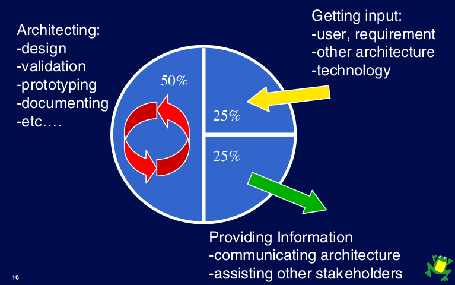
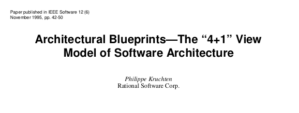
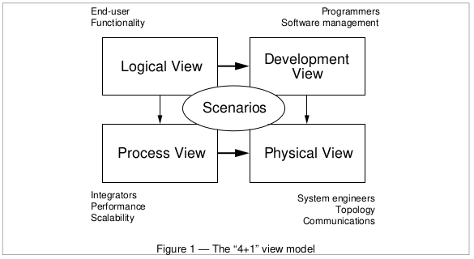

# Fundamentals of Software Architecture: Architecture Activities

**Author:** Kaan Keskin

Date: May 2021

Available at: https://github.com/kaan-keskin/software-architecture-notes

**Resources:**

- Clean Architecture - Robert C. Martin - 2018
- Software Architecture Lecture Notes - University of Alberta - 2017
- Building Evolutionary Architectures: Support Constant Change - Neal Ford - 2017
- Code Complete 2 - Steve McConnell - 2009
- What do software architects really do? - Philippe Kruchten - 2008
- Who Needs an Architect? - Martin Fowler - 2003
- The Architecture Tradeoff Analysis Method - Rick Kazman, Mark Klein, Mario Barbacci, Tom Longstaff, Howard Lipson, Jeromy Carriere - Proceedings of ICECCS98 - July 1998
- Architectural Blueprints—The “4+1” View Model of Software Architecture from Philippe Kruchten - IEEE Software - November 1995
- Software Architecture - Wikipedia: https://en.wikipedia.org/wiki/Software_architecture
- View Model - Wikipedia: https://en.wikipedia.org/wiki/View_model

## What do software architects really do?

To be successful, a software architect — or a software architecture team, collectively — must strike a delicate balance between **an external focus—both outwards: Listening to customers, users, watching technology, developing a long-term vision**, and **inwards: driving the development teams—and an internal, reflective focus: spending time to make the right design choices, validating them, and documenting them**.

The architects should allocate their time in a 50:25:25 (internal:inwards:outwards) ratio as follows:

**Internal focus**: About 50% of their time focused on architecting per se: architectural design, prototyping, evaluating, documenting, etc.

**External focus**: About 50% of their time interacting with other stakeholders. This in turn has two facets:

- **Inwards**: 25% getting input from the outside world: listening to customers, users, product manager, and other stakeholders (developers, distributors, customer support, etc.). Learning about technologies, other systems’ architecture, and architectural practices.

- **Outwards**: 25% providing information or help to other stakeholders or organizations: communicating the architecture: project management, product definition.

Teams that stray too far away from this metastable equilibrium fall into some traps that we describe as anti-patterns of software architecture teams.

## Architectural Anti-patterns

There are several anti-patterns that will make a software architect or software architecture team fail miserably if they were only to design the architecture.

### Anti-pattern: creating a perfect architecture, for the wrong system

A software architect who is not communicating regularly with the customer, the end users, or their representatives (e.g., the product manager) is likely to miss the target, particularly as the target is moving, or rather, as the target is only gradually understood. Ambler and his colleagues call it Gold-plating.

This software architecture team is not engaged enough with its users, particularly the developers. 

They are probably doing a good technical job, as they are getting plenty of input, but if they do not regularly provide value to their immediate environment, **their input will be too late and be ignored**. They have to consistently provide value to the team.

### Anti-pattern: creating a perfect architecture, but too hard to implement

A software architect who does not understand the (maybe limited) skills, capability and experience of the implementation team(s) that will continue and finish the work will create enormous levels of stress and frustration, and likely not deliver a quality product in time. 

The architectural effort has turned into a computer science research project. In Ambler et al. it is called **Strive for Perfection**; related is Coplien’s pattern **Architect’s Implement**: Involving the architects in implementing the architecture would mitigate this anti-pattern.

### Anti-pattern: architects in their ivory tower

Worse is the architecture team that lives isolated in some other part of the organization—another floor, another building, another country—and who comes up after some months with a complete architecture, out of the blue. 

To their complete surprise, they will experience rejection: an apparent misfit on both fronts—functional and implementation. This is especially the case if the developers (the non-architects) had a few months to make some progress and they have in some ways made some architectural decisions, under some other name. See Ambler’s ‘‘Ivory Tower” pattern. 

A special case of this anti-pattern is the **Architecture watch**, an architecture group that only scouts technologies and provides recommendations to other groups, but is not making design decisions and is not accountable for anything, as I have witnessed in two large telecommunication companies. Ambler has two anti-patterns that are similar: **30,000 ft. and Climbing**, and **Real-world Disconnect**.

This is a software architecture team that has isolated itself; it is doing far too much navel gazing. 

They may enjoy themselves, but they are simply not engaged enough with external stakeholders; they are not getting enough input from the users and developers, and they are not providing enough value to their software development organization: such as advocating the architecture, providing assistance to other teams. 

**Even if they do a good job technically, they will rapidly fall off the radar screen, and will be seen as not bringing value.**

### Anti-pattern: the absent architects

Finally, there is another issue that cannot be completely ignored; it has to do with who has been chosen to be the architects.

It is very likely that you have appointed this role some of your most talented staff—good at manipulating abstractions, wide experience of a range of systems and technologies, good communication skills, good domain knowledge, etc.—and you may want to use some of these skills for other tasks than just building architectural views. 

You want them to speak to the new prospective customers, to show off the organization’s technical expertise, to help this or that team that experiences a difficult technical issue.

You want them to review the architecture of another project, to take part of a due diligence process to acquire a company, to present papers a conference to strut your stuff, or to merely extinguish some nasty fire. 

But if you are not careful, this leads to another anti-pattern.

No or little architecture design progress is made: the architects are always away doing fascinating things or fighting fires. It is very easy to slip in this mode, especially after some initial good progress and early successes, which brought some fame on the architects.

This is a software architecture team that is spending far too much time traveling the world. 

Unless this is a very mature system that requires very little architectural work (in which case, maybe the team is overstaffed?), they will run into architectural difficulties.

### Anti-pattern: Just consultants

This is a software architecture team that is acting more as an internal consulting shop; or their travel and conference budget is simply too large. 

If their focus is helping internally, maybe this should be made explicit; if their focus is helping externally, maybe they should review their cost-effectiveness?

This is certainly a case where you may start questioning the architecture team’s composition and also some of its activities.

Are they doing the job of the product definition team, or should they be simply integrated in one of the development team?

## Software Architecture Activities

There are many activities that a software architect performs. 

A software architect typically works with project managers, discusses architecturally significant requirements with stakeholders, designs a software architecture, evaluates a design, communicates with designers and stakeholders, documents the architectural design and more.

**There are four core activities in software architecture design.** These core architecture activities are performed iteratively and at different stages of the initial **Software Development Life-Cycle (SDLC)**, as well as over the evolution of a system.

### Architectural Analysis

**Architectural analysis is the process of understanding the environment in which a proposed system will operate and determining the requirements for the system.**

The input or requirements to the analysis activity can come from any number of stakeholders and include items such as:

- What the system will do when operational (**the functional requirements**)?
- How well the system will perform runtime **non-functional requirements** such as reliability, operability, performance efficiency, security, compatibility?
- Development-time of non-functional requirements such as maintainability and transferability.
- Business requirements and environmental contexts of a system that may change over time, such as legal, social, financial, competitive, and technology concerns.

The outputs of the analysis activity are those requirements that have a measurable impact on a software system's architecture, called **Architecturally Significant Requirements (ASRs)**.

### Architectural Synthesis

**Architectural synthesis or design is the process of creating an architecture.**

Given the architecturally significant requirements determined by the analysis, the current state of the design and the results of any evaluation activities, the design is created and improved.

### Architecture Evaluation 

**Architecture evaluation is the process of determining how well the current design or a portion of it satisfies the requirements derived during analysis.**

An evaluation can occur whenever an architect is considering a design decision, it can occur after some portion of the design has been completed, it can occur after the final design has been completed or it can occur after the system has been constructed. 

Some of the available software architecture evaluation techniques include **Architecture Trade-off Analysis Method (ATAM)** and TARA.

### Architecture Evolution

**Architecture evolution is the process of maintaining and adapting an existing software architecture to meet changes in requirements and environment.**

As software architecture provides a fundamental structure of a software system, its evolution and maintenance would necessarily impact its fundamental structure. 

As such, **architecture evolution is concerned with adding new functionality as well as maintaining existing functionality and system behavior.**

Architecture requires critical supporting activities. These supporting activities take place throughout the core software architecture process. They include knowledge management and communication, design reasoning and decision making, and documentation.

Book Recommendation:

- **Building Evolutionary Architectures: Support Constant Change - Neal Ford - 2017**

## Analyzing and Evaluating an Architecture

In addition to designing a system, **it is important to know how to evaluate the design to determine if it addresses the concerns, or the requirements, of all stakeholders**.

**Analyzing and evaluating software architecture can be difficult due to the abstract nature of software.**

**It is important to methodically analyze and evaluate a system’s behaviors, quality attributes, and various characteristics.**

### Quality Attribute Scenarios

In order to measure quality attributes, **quality attribute scenarios** can be used to determine if a system is able to meet requirements set for the attribute. 

There are two kinds of scenarios:

- A **general scenario**, which is used to characterize any system
- A **concrete scenario**, which is used to characterize a specific system

Both general and concrete scenarios have:
- A **stimulus source**, which is anything that creates a stimulus. It can be internal or external to the system.
- A **stimulus** is a condition that will cause the system to respond. As the source of the condition can originate internally or externally, types of conditions will need to be differentiated.
- An **environment** is the mode of the system when it is receiving a stimulus. This is an important aspect, particularly if the system involves distributed computing, or if it can exist in operational modes besides just running and stopped, like recovering from a failure.
- An **artifact** is the part of the system that is affected by the stimulus. In large-scale systems, a stimulus should not directly affect the entire system.
- A **response** is how the artifact will behave as a result of receiving a stimulus. This response could include handling an error, recovering from a failure, updating system logs, dispatching security alerts, or changing the current environments.
- A **response measure** is a metric used to quantify the response so that the quality attribute can be measured. The metric should be quantitative and objective, such as probability of failure, response time, repair time, and average system load.

Scenarios are built to identify situations that impact the quality attributes of a system. In the context of analyzing and evaluating architecture, you should focus on situations that are outside of the normal execution path. This means that scenarios involving incorrect input, heavy system loads, or potential security breaches should be prioritized highly.

**It is a system’s “inability” to handle unexpected failures that stops it from achieving a specific quality attribute.**

### Availability Example

Let us consider scenarios through an example. 

**Imagine you are addressing the availability of a system. In addition to focusing on when a system is online and behaving normally, you have to consider situations where the system becomes unavailable.**

**In a general scenario, high-level events are summarized.** As a single scenario may involve many component values, it often summarized in a table.

Below is an example of a **general** availability scenario.

| Scenario Component | Scenario Component Value |
| :--- | :--- |
| **Stimulus Source** | - End user |
| | - Internal subsystems |
| | - External subsystems |
| **Stimulus** | - Incorrect user input |
| | - Internal exceptions |
| | - Unrecognized system request |
| | - High request volume |
| | - Heavy system load |
| **Environment** | - Normal operating environment |
| | - Starting up |
| | - Shutting down |
| | - Heavy load operating environment |
| | - Recovering from error |
| | - Processing request |
| **Artifact** | - System servers |
| | - System process |
| **Response** | - Log exceptions |
| | - Notify user |
| | - Send error response to external system |
| | - Redistribute data processing |
| | - Redistribute system requests |
| | - Notify user and external systems that the system is shutting down/starting up |
| **Response Measure** | - Time to restart (shutdown and startup sequence) |
| | - Time to undergo recovery |
| | - Time to complete requests when the request volume is high |
| | - Time to complete a process under heavy system load |
| | - Time to become available after encountering an incorrect input or request |

**Concrete scenarios are more focused.** **They can help you test an architecture with a specific stimulus under specific system environments and measure how well the system can respond.**

Let us expand our example on availability. Availability of a web server can be hindered in its ability to process requests when at resource limits or under heavy load. A server’s availability should be measured under different conditions.

Consider the specific concrete scenario below, where a customer needs to wait for the system to finish processing previous orders for concert tickets before they are able to send their purchase request.

The system is unavailable for customers if the system can’t accept their request for tickets, which has a negative effect on the availability quality attribute of the system.

### Architecture Trade-off Analysis Method

There are a number of methods that can be used to implement scenarios in analysis and evaluation of the entire architecture. 

This section will focus on an evaluation technique developed by the **Software Engineering Institution at Carnegie Mellon University** known as Architecture Trade-off Analysis Method (ATAM).

**With ATAM, evaluators do not need to be familiar with the architecture or the problem space. A system can be evaluated by outsiders.**

**The method came to life because of a need to have a structured way to assess the fitness of an architectural solution when regarding non-functional attributes such as modifiability, security, performance, availability, and so forth. Basically, all the attributes specified in the ISO-25010 standard.**

The attributes in this standard interact with each other to strengthen or weaken their colleagues with each design choice. A well-known example of this interaction is the CAP Theorem. 

**The principle idea of ATAM is to ask the proper questions about how their interaction should be, and to be able to ask these questions as soon as possible.**

### Example Trade-off: CAP Theorem

**CAP theorem states it is impossible for a distributed system to simultaneously provide more than two of these three guarantees: consistency, availability, and partition tolerance.** Let us establish a few definitions. 

**Consistency**: consistency means all clients see the same data at the same time no matter which node they connect to.

**Availability**: availability means any client which requests data gets a response even if some of the nodes are down.

**Partition Tolerance**: a partition indicates a communication break between two nodes. Partition tolerance means the system continues to operate despite network partitions.

**CAP theorem states that one of the three properties must be sacrificed to support 2 of the 3 properties.**

Nowadays, key-value stores are classified based on the two CAP characteristics they support:

**CP (consistency and partition tolerance) systems**: a CP key-value store supports consistency and partition tolerance while sacrificing availability.

**AP (availability and partition tolerance) systems**: an AP key-value store supports availability and partition tolerance while sacrificing consistency.

**CA (consistency and availability) systems**: a CA key-value store supports consistency and availability while sacrificing partition tolerance. Since network failure is unavoidable, a distributed system must tolerate network partition. Thus, a CA system cannot exist in real-world applications.

### 4-Phases of the Architecture Trade-off Analysis Method

It does so by using a spiral model of design, that consists of four major phases: scenario and requirements gathering, architectural views and scenario realization, model building and analysis, and trade-offs. 

As shown on the illustration, these phases are then divided into different steps. 

4-Phases of the Architecture Trade-off Analysis Method:

### Participants in ATAM

There are three different groups of participants in ATAM.

- The first is the **evaluation team**. This has three different subgroups: designers, peers, and outsiders. Evaluation teams must be unbiased.

    - **Designers** are the subgroup involved with architectural design. They naturally follow iterative, hypothesis-driven methods when designing, including analyzing systems requirements, creating a design to address those requirements, and reviewing the design.

    - **Peers** are the subgroup composed of those who are part of the project, but they are not involved in the design process. Their point-of-views helps round out design decision.

    - **Outsiders** are the subgroup composed of those external to the project or organization. Involvement of outsiders helps eliminate bias towards the project in evaluation. Outsiders should have experience and expertise in analyzing architecture.

- **Project decision makers** are a participant group of project representatives with the authority to make project decisions. This could include project managers, clients, product owners, software architects, and technical leads.

- **Architecture stakeholders** are a participant group of those who want the architecture to successfully address business needs, but who are not actively involved in the evaluation process. This could include end users, developers, and support staff.

### 9-Steps of the Architecture Trade-off Analysis Method

In an ATAM, a software project is initiated when business drivers identify a need for a system to address some problem. Business drivers go hand in hand with the system architecture, which is created as the solution to the business issues. Together, business drivers and system architecture determine the quality attributes of the system, the architectural approach taken, and the design decisions that are made. These combine together to create quality attribute scenarios.

Scenarios can then be analyzed, resulting in an evaluation of the system, which includes trade-offs, sensitivity points, non-risk scenarios, and risk scenarios. Since the risk scenarios have a negative impact on the quality of the system, each of them are analyzed and categorized into “risk themes.”

The diagram below illustrates this high-level process for ATAM.

The entire ATAM process itself can be broken down into nine steps.

1. **Present the ATAM.**

    The evaluation team presents the ATAM process. This includes: the context for the evaluation, expectations, procedures, outputs, and addresses any concerns about the evaluation.

2. **Present the business drivers.**

    The project decision makers present the business problem and the goals for the system as well as the system’s features and requirements, project constraints, and scope.

3. **Present the architecture.**

    Both current and expected state of the architecture is presented as well as constraints such as time, cost, difficulty of the problem, and quality expectations.

4. **Identify the architectural approaches.**

    This analysis activity involves examining the architectural patterns that have been used in the system. This step analyzes the documentation and the notes from presentations and asks questions to gain more clarity about the system.

5. **Create a quality attribute tree.**

    A **quality attribute utility tree** is created, which maps the quality-related **Architecturally Significant Requirements (ASR)s** for each quality attribute. ASRs arise from the business drivers.

    To build such a tree, the overall “utility” of a system is broken down into quality attributes, which are refined into attribute refinements. **Attribute refinements** are more specific qualities of a system. Once the quality attributes have been refined, ASRs can be associated with the appropriate attribute.

    This step provides insight into the system and identifies quality priorities. This step should be conducted in conjunction with project decision makers.

    

    **In quality attribute trees, ASRs are given priority values to denote if they are “must-haves” or not. The example above uses high (H), medium (M), and low (L) designations, but these values could differ from system to system.**

6. **Analyze the architectural approaches.**

    Using the prioritized ASRs from the utility tree, examine the architecture and determine how it addresses each ASR. This allows for the identification and documentation of risk and non-risk scenarios, sensitivity points, and trade-offs. This step reveals the capabilities of the system and consequences of design decisions. It is not meant to be comprehensive, but it identifies connections between business drivers and system architectures.

7. **Brainstorm and prioritize scenarios.**

    In this step, each group of participants creates quality attribute scenarios that are important to them, which they would expect when using the system. Scenarios with similar quality concerns or behaviors can be merged. This step provides an overview of the day-to-day system usage and insights into the environment that the system can be in.

    Scenarios are prioritized based on importance to each stakeholder, and the evaluation team compares the list with the prioritized ASRs in the utility tree. If the priorities of the stakeholders match closely with the priorities in the utility tree, then there is good alignment.

    There is a risk if there are many additional scenarios discovered during this step that were not in the original set of ASRs. It is an indication that the architecture is not able to address the needs of stakeholders.

8. **Re-analyze the architectural approaches.**

    **Recreate a utility tree, but this time, using the top five to ten scenarios prioritized in the previous step.** This new tree can be used to talk with the system architect and discover how each scenario can be achieved with the system design.

    

9. **Present the results.**

    Results of the evaluation are compiled together. This includes all architecture documents, utility trees, risk and non-risk scenarios, sensitivity points, trade-offs, and risk themes. Risk scenarios should be grouped together by risk theme. Risk themes help identify which business drivers are affected.

ATAM helps expose unseen risks for stakeholders involved in the architectural process.

**Modern systems are becoming more and more complex, and creating an architecture that can achieve all the requirements for quality attributes is becoming increasingly important. Being able to evaluate and analyze architectures helps successfully create high-quality systems.**

**ATAM is a common method for analyzing and evaluating architectures, especially as it does not require evaluators to have intimate knowledge of the system, and covers the viewpoints of all important stakeholders. ATAM helps minimize risks in a system by identifying them and helps architects minimize the effects of sensitivity points and be sensible about trade-offs.**

ATAM also helps facilitate communication between stakeholders, including identifying issues with newly discovered functionalities that the stakeholders expressed to be important.

## Architecture View Models (Viewpoints)

**A view model or viewpoints framework in systems engineering, software engineering, and enterprise engineering is a framework which defines a coherent set of views to be used in the construction of a system architecture, software architecture, or enterprise architecture.**

**A view is a representation of a whole system from the perspective of a related set of concerns.**

**The purpose of views and viewpoints is to enable humans to comprehend very complex systems, to organize the elements of the problem and the solution around domains of expertise and to separate concerns.**

Software architecture descriptions are commonly organized into views, which are analogous to the different types of blueprints made in building architecture. 

Each view addresses a set of system concerns, following the conventions of its viewpoint, where a viewpoint is a specification that describes the notations, modeling, and analysis techniques to use in a view that expresses the architecture in question from the perspective of a given set of stakeholders and their concerns (ISO/IEC/IEEE 42010). 

The viewpoint specifies not only the concerns framed (i.e., to be addressed) but the presentation, model kinds used, conventions used and any consistency (correspondence) rules to keep a view consistent with other views. 

## Kruchten’s 4+1 View Model

**Kruchten's 4+1 View Model** presents a model for describing the architecture of software-intensive systems, based on the use of multiple, concurrent views. 

**This use of multiple views allows to address separately the concerns of the various ‘stakeholders’ of the architecture: end-user, developers, systems engineers, project managers, etc., and to handle separately the functional and non-functional requirements.** 

Each of the five views is described, together with a notation to capture it. The views are designed using an architecture-centered, scenario-driven, iterative development process.

**We all have seen many books and articles where one diagram attempts to capture the gist of the architecture of a system. But looking carefully at the set of boxes and arrows shown on these diagrams, it becomes clear that their authors have struggled hard to represent more on one blueprint than it can actually express.**

### An Architectural Model

**Software architecture deals with the design and implementation of the high-level structure of the software.** 

It is the result of assembling a certain number of architectural elements in some well-chosen forms to satisfy the major functionality and performance requirements of the system, as well as some other, non-functional requirements such as reliability, scalability, portability, and availability.

**Software architecture deals with abstraction, with decomposition and composition, with style and aesthetics.**

**To describe a software architecture, we use a model composed of multiple views or perspectives.**

 In order to eventually address large and challenging architectures, the model we propose is made up of five main views:

- **The logical view**, which is the object model of the design (when an object-oriented design method is
  used),
- **The process view**, which captures the concurrency and synchronization aspects of the design,
- **The physical view**, which describes the mapping(s) of the software onto the hardware and reflects its
  distributed aspect,
- **The development view**, which describes the static organization of the software in its development
  environment.

**The description of an architecture—the decisions made—can be organized around these four views, and
then illustrated by a few selected use cases, or scenarios which become a fifth view.**

### The Logical Architecture

*The Object-Oriented Decomposition*

**The logical architecture primarily supports the functional requirements—what the system should provide in terms of services to its users.**

The system is decomposed into a set of key abstractions, taken (mostly) from the problem domain, in the form of objects or object classes. They exploit the principles of abstraction, encapsulation, and inheritance. This decomposition is not only for the sake of functional analysis, but also serves to identify common mechanisms and design elements across the various parts of the system.

Mapping to UML 2 Diagrams:

- Class Diagram
- Object Diagram
- Package Diagram
- Composite Structure Diagram
- State Machine Diagram

Source: https://www.uml-diagrams.org

### The Process Architecture

*The Process Decomposition*

**The process view presents processes that correspond to the objects in the logical view.**

**The process architecture takes into account some non-functional requirements, such as performance and availability.** It addresses issues of concurrency and distribution, of system’s integrity, of fault-tolerance, and **how the main abstractions from the logical view fit within the process architecture**—on which thread of control is an operation for an object actually executed.

**The process architecture can be described at several levels of abstraction, each level addressing different concerns.**

At the highest level, the process architecture can be viewed as a set of independently executing logical networks of communicating programs (called “processes”), distributed across a set of hardware resources connected by a LAN or a WAN. Multiple logical networks may exist simultaneously, sharing the same physical resources. 

**A process is a grouping of tasks that form an executable unit.** 

Processes represent the level at which the process architecture can be tactically controlled (i.e., started, recovered, reconfigured, and shut down). In addition, processes can be replicated for increased distribution  of the processing load, or for improved availability.

**The software is partitioned into a set of independent tasks.**

**A task is a separate thread of control, that can be scheduled individually on one processing node.**

We can distinguish then: major tasks, that are the architectural elements that can be uniquely addressed and minor tasks, that are additional tasks introduced locally for implementation reasons (cyclical activities, buffering, time-outs, etc.).

Mapping to UML 2 Diagrams:

- Sequence Diagram
- Communication Diagram
- Activity Diagram
- Timing Diagram
- Interaction Overview

Source: https://www.uml-diagrams.org

### The Development Architecture

*Subsystem decomposition*

**The development architecture focuses on the actual software module organization on the software development environment.**

**The development view describes the hierarchical software structure.**

It also considers elements such as programming language, libraries, and tool-sets. It is concerned with the details of software development and what is involved to support that. This extends to management details such as scheduling, budgets, and work assignments. Essentially, the development view covers the hierarchical software structure and project management.

The software is packaged in small chunks—program libraries, or subsystems— that can be developed by one or a small number of developers. The subsystems are organized in a hierarchy of layers, each layer providing a narrow and well-defined interface to the layers above it.

The development architecture of the system is represented by module and subsystem diagrams, showing the ‘export’ and ‘import’ relationships. The complete development architecture can only be described when all the elements of the software have been identified. It is, however, possible to list the rules that govern the development architecture: partitioning, grouping, visibility.

**For the most part, the development architecture takes into account internal requirements related to the ease of development, software management, reuse or commonality, and to the constraints imposed by the tool-set, or the programming language.**

The development view serves as the basis for requirement allocation, for allocation of work to teams (or even for team organization), for cost evaluation and planning, for monitoring the progress of the project, for reasoning about software reuse, portability and security. 

**It is the basis for establishing a line-of-product.**

Mapping to UML 2 Diagrams:

- Component diagram
- Package diagram

Source: https://www.uml-diagrams.org

### The Physical Architecture

*Mapping the software to the hardware*

**The physical architecture takes into account primarily the non-functional requirements of the system such as availability, reliability (fault-tolerance), performance (throughput), and scalability.**

**The physical view handles how elements in the logical, process, and development views must be mapped to different nodes or hardware for running the system.**

The software executes on a network of computers, or processing nodes (or just nodes for short). The various elements identified— networks, processes, tasks, and objects—need to be mapped onto the various nodes.

We expect that several different physical configurations will be used: some for development and testing, others for the deployment of the system for various sites or for different customers. 

The mapping of the software to the nodes therefore needs to be highly flexible and have a minimal impact on the source code itself.

Mapping to UML 2 Diagrams:

- Deployment Diagram

Source: https://www.uml-diagrams.org

### Scenarios

*Putting it all together*

**Scenarios align with the use cases or user tasks of a system and show how the four other views work together.**

**The elements in the four views are shown to work together seamlessly by the use of a small set of important scenarios** —instances of more general use cases—for which we describe the corresponding scripts (sequences of interactions between objects, and between processes).

**For each scenario, there is a script that describes the sequence of interactions between objects and processes.** 

This involves the key objects defined in the logical view, the processes described in the process view, the hierarchy identified in the development view, and the different nodes specified in the physical view. Scenarios relate these elements to provide a complete picture.

**The scenarios are in some sense an abstraction of the most important requirements. **

Their design is expressed using object scenario diagrams and object interaction diagrams. This view is redundant with the other ones (hence the “+1”), but it serves two main purposes:

- as a driver to discover the architectural elements during the architecture design.
- as a validation and illustration role after this architecture design is complete, both on paper and as the
  starting point for the tests of an architectural prototype.

Mapping to UML 2 Diagrams:

- Use Case Diagram
- Activity Diagram

Source: https://www.uml-diagrams.org

***None of the views are fully independent of each other, with elements of some views connected to others. The 4+1 view model can be molded to fit many situations to understand the architecture of a software system. Being able to see a complex problem in many different perspectives helps make your software more versatile.***

