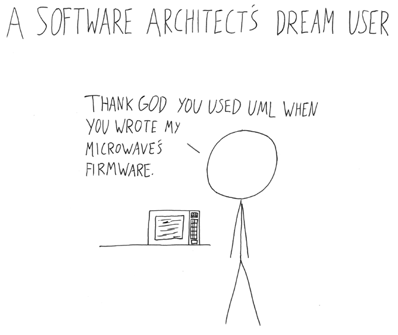
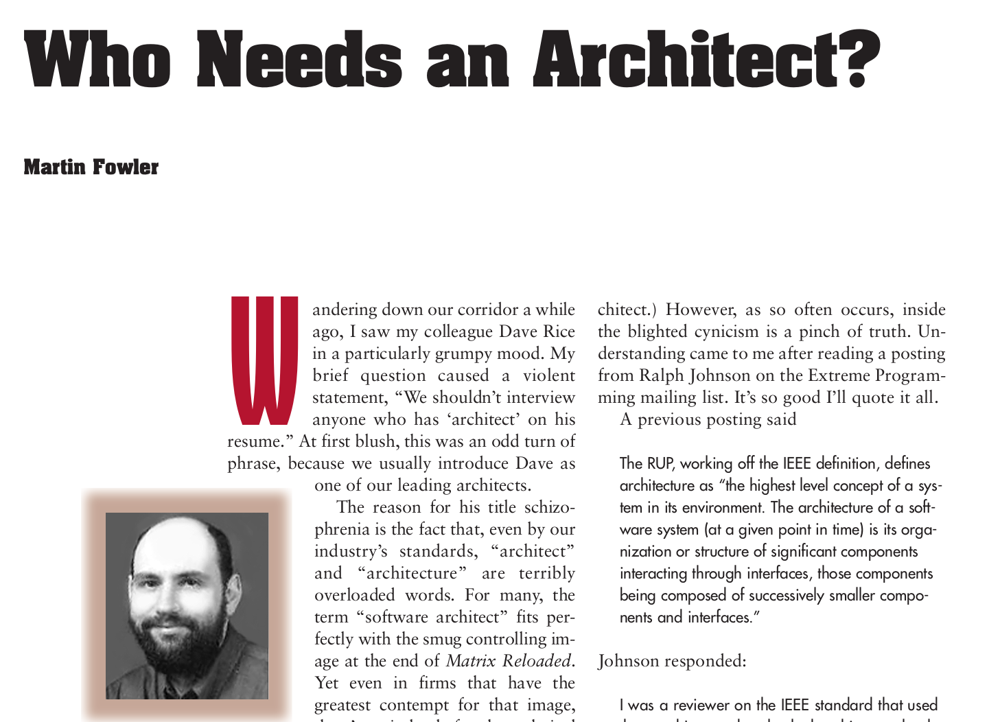
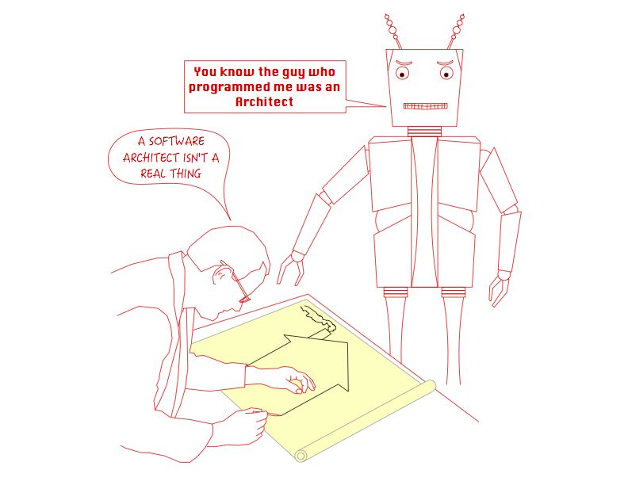

# Fundamentals of Software Architecture: Architecture Activities

**Author:** Kaan Keskin

Date: May 2021

Available at: https://github.com/kaan-keskin/software-architecture-notes

**Resources:**

- Clean Architecture - Robert C. Martin - 2018
- Software Architecture Lecture Notes - University of Alberta - 2017
- Building Evolutionary Architectures: Support Constant Change - Neal Ford - 2017
- Code Complete 2 - Steve McConnell - 2009
- What do software architects really do? - Philippe Kruchten - 2008
- Who Needs an Architect? - Martin Fowler - 2003
- The Architecture Tradeoff Analysis Method - Rick Kazman, Mark Klein, Mario Barbacci, Tom Longstaff, Howard Lipson, Jeromy Carriere - Proceedings of ICECCS98 - July 1998
- Architectural Blueprints—The “4+1” View Model of Software Architecture from Philippe Kruchten - IEEE Software - November 1995
- Software Architecture - Wikipedia: https://en.wikipedia.org/wiki/Software_architecture
- View Model - Wikipedia: https://en.wikipedia.org/wiki/View_model

## Software Architecture Overview (recap)

**Software architecture is the fundamental design of an entire software system.** 

It defines what elements are included in the system, what function each element has, and how each element relates to one another.

**It is the big picture or overall structure of the whole system—how everything works together.**

It follows that to design a software system, a software architect has to take many factors into consideration:

- the purpose of the system,
- the audience or users of the system,
- the qualities that are of most importance to users, and
- where the system will run.

***Benefits:*** Software architecture is important, particularly for large systems. **If there is a clear design of the overall system from the start, there is a solid basis for developers to follow.** Each developer will then know what needs to be implemented and how things are related to meet desired needs efficiently. This avoids conflicts, duplication, and ad hoc unnecessary work.

**Some advantages of software architecture include:**

- **higher productivity** for the software team, as a well-defined structure helps to coordinate work, implement individual features, or guide discussions on potential issues.
- improved **evolution** for the software, since design principles are applied to make changes easier to accomplish or defects easier to find.
- enhanced **quality** in the software by carefully considering the needs and perspectives of all the stakeholders.

## Who Needs an Architect?

**In most successful software projects, the expert developers working on that project have a shared understanding of the system design. This shared understanding is called architecture**.

This understanding includes how the system is divided into components and how the components interact through interfaces. These components are usually composed of smaller components, but the architecture only includes the components and interfaces that are understood by all the developers.

This would be a better definition because it makes clear that architecture is a social construct (well, software is too, but architecture is even more so) because it doesn’t just depend on the software, but on what part of the software is considered important by group consensus.

**Architecture is about the important stuff. Whatever that is.**

