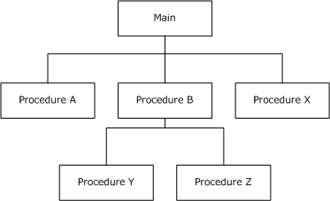
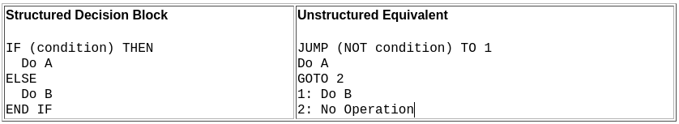
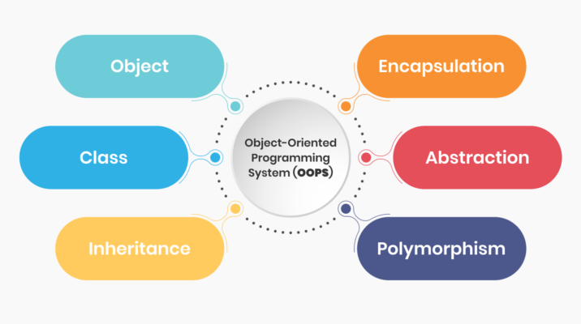

# Fundamentals of Software Architecture: Extra Topics I - Programming Paradigms

**Author:** Kaan Keskin

Date: May 2021

Available at: https://github.com/kaan-keskin/software-architecture-notes

**Resources:**

- Clean Architecture - Robert C. Martin - 2018
- Software Architecture Lecture Notes - University of Alberta - 2017
- Code Complete 2 - Steve McConnell - 2009
- [*A Case against the GO TO Statement (EWD-215)*](http://www.cs.utexas.edu/users/EWD/ewd02xx/EWD215.PDF) - Dijkstra, Edsger W. - 1968
- Letters to the editor: go to statement considered harmful - Edsger W. Dijkstra - [Communications of the ACM](https://dl.acm.org/magazine/cacm) - March 1968
- Flow diagrams, turing machines and languages with only two formation rules - Corrado Bohm, Giuseppe Jacopini - [Communications of the ACM](https://dl.acm.org/magazine/cacm) - May 1966

## Programming Paradigms

**Software architecture begins with the code**—and so we will begin our discussion of architecture by looking at what we’ve learned about code since code was first written.

**Probably more significant, revolution was in programming paradigms.**

All programming languages can be classified, based on their features, into some programming paradigm. Some of these paradigms are concerned with implications for the execution model of the language or whether the sequence of operations is defined by the execution model. Others with the way that code is organized, such as grouping code into units along with the state that is modified by the code. And yet others are concerned with the style of syntax and grammar.

**Paradigms are ways of programming, relatively unrelated to languages.**

**A paradigm tells you which programming structures to use, and when to use them.**


Imperative is the counter part of declarative. Imperative basically means that you tell the computer what to do by having it execute a series of instructions that you provide. A declarative program on the other hand tells what is to be achieved. In other words, it is defining steps versus defining a result.

### Imperative Programming

**Imperative programming focuses on HOW to execute program logic and defines control flow as statements that change a program state.**

Main traits include direct assignments, common data structures, and global variables. Example: C, C++, Java, PHP, Python, Ruby.

```C
int total = 0;
int number1 = 5;
int number2 = 10;
int number3 = 15;
total = number1 + number2 + number3;
```

**Each statement changes the state of the program, from assigning values to each variable to the final addition of those values.**

Using a sequence of five statements the program is explicitly told how to add the numbers 5, 10 and 15 together.

### Structured/Procedural Programming

In the **1960s**, extensive use of control transfers was causing difficulty in software development. Blame was pointed at the **goto statement**. This statement allowed you to transfer control to one of many possible destinations in a program. 


In **1966**, Bohm and Jacopini’s research demonstrated that programs could be written without goto statements. Bohm and Jacopini demonstrated that **all programs could be written using three forms of control—namely, sequential execution, the selection statement and the repetition statement.** 


The first paradigm to be adopted (but not the first to be invented) was structured programming, which was discovered by **Edsger Wybe Dijkstra** in **1968**.

Dijkstra showed that the use of unrestrained jumps (**goto statements**) is harmful to program structure. He replaced those jumps with the more familiar **if/then/else** and **do/while/until** constructs.


**The notion of structured programming became almost synonymous with “goto elimination.”**

#### Unstructured Programming

**Unstructured Programming is a type of programming that generally executes in sequential order i.e., these programs just not jumped from any line of code and each line gets executed sequentially.**

Non-structured programming is the historically earliest programming paradigm capable of creating Turing-complete algorithms. 
It is often contrasted with the structured programming paradigm, in particular with the use of unstructured control flow using goto statements or equivalent.

**Unstructured programming has been heavily criticized for producing hardly-readable ("spaghetti") code.**

**A program in a non-structured language uses unstructured jumps to labels or instruction addresses. The lines are usually numbered or may have labels: this allows the flow of execution to jump to any line in the program.**

In the beginning, all branching was done using GOTO. Assembly language, Fortran, and BASIC are perfect examples of unstructured programming. An unstructured program might look like this:


There are both high- and low-level programming languages that use non-structured programming. Some languages commonly cited as being non-structured include JOSS, FOCAL, TELCOMP, assembly languages, MS-DOS batch files, and early versions of BASIC, Fortran, COBOL, and MUMPS. 

It is also known as non-structured programming that is capable of creating turning-complete algorithms.

#### Procedural Programming

**Procedural programming refers the ability of the processor (either hardware or an interpreter) to wrap up instructions into compounds, jump to such a compound and return to the point after the jump once the compound has been executed.**

This may sound trivial and by today's standards it is, but you need some basic support in the machine before you can do this: the ability to jump, some sort of stack to push an address on that can be popped and jumped to later and a stack pointer. 

Micro processors soon offered this feature but you can imagine a primitive processor that is only capable of executing instructions fed to it sequentially, like a punch tape or punch card processor.



**Procedural programming is a method of the programming which has a support of splitting the functionalities into a number of procedures. In procedural programming, a large program is broken down into smaller manageable parts called procedures or functions.**

#### Structured Programming

Structured programming is the next step up from the ability to jump to another instruction. Ultimately everything comes down to jumps but if you can have conditional jumps, you can build basic control flow statements like if-then, for, while, repeat-until and switch. Applying those is called structured programming.

**Structured Programming is a type of programming that generally converts large or complex programs into more manageable and small code of pieces.**

These small codes of pieces are usually known as **functions** or **modules** or **sub-programs** of large complex programs.

It is known as modular programming and minimizes the chances of function affecting another.

Structured programs are clearer, easier to debug and change, and more likely to be bug-free.



We can summarize the structured programming paradigm as follows:

- ***Structured programming imposes discipline on direct transfer of control.***


Examples of structured programming languages:

```
C : developed by Dennis Ritchie and Ken Thompson
C++ : developed by Bjarne Stroustrup
Java : developed by James Gosling at Sun Microsystems
ColdFusion : developed by J J Allaire
Pascal : developed by Niklaus Wirth 
```

#### Functional Decomposition

**Structured programming allows modules to be recursively decomposed into provable units, which in turn means that modules can be functionally decomposed.**

That is, you can take a large-scale problem statement and decompose it into high-level functions. Each of those functions can then be decomposed into lower-level functions, ad infinitum. Moreover, each of those decomposed functions can be represented using the restricted control structures of structured programming.


**This is a top-down approach to software design. Functional Decomposition breaks a large problem into successively smaller chunks, until at last we reach the function level.**

Building on this foundation, disciplines such as structured analysis and structured design became popular in the late 1970s and throughout the 1980s. Men like Ed Yourdon, Larry Constantine, Tom DeMarco, and Meilir Page-Jones promoted and popularized these techniques throughout that period. By following these disciplines, programmers could break down large proposed systems into modules and components that could be further broken down into tiny provable functions.

Structured Analysis and System Specification, 1979 by Tom DeMarco:


#### Structured vs Unstructured Programming


Additional Information:

|Structured Programming | Unstructured Programming |
| --- | --- |
| It is basically a subset of procedural programs. | It is basically a procedural program. |
| In this, programmers are allowed to code a program simply by dividing the program into modules or smaller units. | In this, programmers are not allowed code divide programs into small units. Instead, the program should be written as a single continuous block without any breakage. |
| It is more user-friendly and easy to understand as compared to unstructured programming. | It is less user-friendly and little hard to understand as compared to structured programming. |
| It is easier to learn and follow. | 	It is difficult to learn and follow. |
| Its advantages include reduce complexity, facilitate debugging, increase programmer productivity programs, etc. | Its advantages include its speed. |
| Such programs can be used for small and medium-scale projects and also for complex projects. | Such programs cannot be used for medium and complex projects. Instead, they can be used for small and easier projects. |
| These programs do not allow code duplication. | These programs allow code duplication. |
| Structured programs use a greater number of data types as compared to unstructured programs. | Unstructured programs use a limited number of data types as compared to structured programs. |
| It does not use GOTO to control the flow of execution. Instead, it uses loops. | It uses GOTO to control the flow of execution. |
| It produces readable code. | 	It hardly produces readable code. |
| It does not provide full freedom to programmers to program as they want. | It provides full freedom to programmers to program as they want. |
| Languages: C, C+, C++, C#, Java, PERL, Ruby, PHP, ALGOL, Pascal, PL/I and Ada | Languages: Early versions of BASIC (such as MSX BASIC and GW-BASIC), JOSS, FOCAL, MUMPS, TELCOMP, COBOL, machine-level code |

### Object-Oriented Programming

The second paradigm to be adopted was actually discovered two years earlier, in **1966**, by **Ole Johan Dahl** and **Kristen Nygaard**. 

These two programmers noticed that the function call stack frame in the ALGOL language could be moved to a heap, thereby allowing local variables declared by a function to exist long after the function returned. The function became a constructor for a class, the local variables became instance variables, and the nested functions became methods. This led inevitably to the discovery of polymorphism through the disciplined use of function pointers.


We can summarize the object-oriented programming paradigm as follows:

- ***Object-oriented programming imposes discipline on indirect transfer of control.***



#### What is Object Oriented?

There are many opinions and many answers to this question.

**To the software architect, however, the answer is clear: OO is the ability, through the use of polymorphism, to gain absolute control over every source code dependency in the system.**

It allows the architect to create a plugin architecture, in which modules that contain high-level policies are independent of modules that contain low-level details. The low-level details are relegated to plugin modules that can be deployed and developed independently from the modules that contain high-level policies.

The four principles of object-oriented programming are encapsulation, abstraction, inheritance, and polymorphism.

These words may sound scary for a junior developer. And the complex, excessively long explanations in Wikipedia sometimes double the confusion.

```Javascript
function Person(firstName, lastName) {
    // construct the object using the arguments
    this.firstName = firstName;
    this.lastName = lastName;

    // a method which returns the full name
    this.fullName = function() {
        return this.firstName + " " + this.lastName;
    }
}

var myPerson = new Person("John", "Smith");
console.log(myPerson.fullName());
```

#### Encapsulation

**The whole idea behind the data encapsulation is to hide the implementation details from users. This is achieved through the state (the private fields) and the behaviors (the public methods) of a Class.**

**Often, for practical reasons, an object may wish to expose some of its variables or hide some of its methods.**

**Encapsulation uses three common types of modifier to encapsulate data.**

- Public
- Private
- Protected

The reason encapsulation is cited as part of the definition of OO is that OO languages provide easy and effective encapsulation of data and function. As a result, a line can be drawn around a cohesive set of data and functions. Outside of that line, the data is hidden and only some of the functions are known. We see this concept in action as the private data members and the public member functions of a class.

**Encapsulation is achieved when each object keeps its state private, inside a class. Other objects don’t have direct access to this state. Instead, they can only call a list of public functions — called methods.**

**So, the object manages its own state via methods — and no other class can touch it unless explicitly allowed. If you want to communicate with the object, you should use the methods provided. But (by default), you can’t change the state.**

#### Abstraction

Abstraction can be thought of as a natural extension of encapsulation.

In object-oriented design, programs are often extremely large. And separate objects communicate with each other a lot. So maintaining a large codebase like this for years — with changes along the way — is difficult.

Abstraction is a concept aiming to ease this problem.

**Applying abstraction means that each object should only expose a high-level mechanism for using it.**

**This mechanism should hide internal implementation details. It should only reveal operations relevant for the other objects.**

Think — a coffee machine. It does a lot of stuff and makes quirky noises under the hood. But all you have to do is put in coffee and press a button.

**Preferably, this mechanism should be easy to use and should rarely change over time. Think of it as a small set of public methods which any other class can call without “knowing” how they work.**

#### Inheritance

OK, we saw how encapsulation and abstraction can help us develop and maintain a big codebase.

But do you know what is another common problem in OOP design?

**Objects are often very similar. They share common logic. But they’re not entirely the same.**

So how do we reuse the common logic and extract the unique logic into a separate class? One way to achieve this is inheritance.

**It means that you create a (child) class by deriving from another (parent) class. This way, we form a hierarchy.**

**The child class reuses all fields and methods of the parent class (common part) and can implement its own (unique part).**


#### Polymorphism

**Polymorphism means “many shapes” in Greek.** 

It is the ability to appear in many forms.

So we already know the power of inheritance and happily use it. But there comes this problem.

Say we have a parent class and a few child classes which inherit from it. Sometimes we want to use a collection — for example a list — which contains a mix of all these classes. Or we have a method implemented for the parent class — but we’d like to use it for the children, too.

This can be solved by using polymorphism.

In Object-Oriented Programing, polymorphism refers to a programming language's ability to process objects differently depending on their data type or class.

**Simply put, polymorphism gives a way to use a class exactly like its parent so there’s no confusion with mixing types. But each child class keeps its own methods as they are.**

This typically happens by defining a (parent) interface to be reused. It outlines a bunch of common methods. Then, each child class implements its own version of these methods.

Any time a collection (such as a list) or a method expects an instance of the parent (where common methods are outlined), the language takes care of evaluating the right implementation of the common method — regardless of which child is passed.

Examples of Object Oriented programming languages:

```
Simula : first OOP language
Java : developed by James Gosling at Sun Microsystems
C++ : developed by Bjarne Stroustrup
Objective-C : designed by Brad Cox
Visual Basic .NET : developed by Microsoft
Python : developed by Guido van Rossum
Ruby : developed by Yukihiro Matsumoto 
Smalltalk : developed by Alan Kay, Dan Ingalls, Adele Goldberg
``` 

#### Object-Based Programming

**Object-Based Programming is based on the idea that of encapsulating state and operations inside "objects".**

**Object-based languages need not support inheritence or polymorphism. While Object-Oriented Language support all feature of OOPS.**

#### Why we use Object-Based instead of Object-Oriented?

**The main benefit of the Object-Based Programming is that it can be understood by the common humans.**

**Object-Based is much easier and more robust than Object-Oriented.**

**It allows for fast creation of web page events.**

**It allows more freedom in the creation of objects.**

#### A Note About Object-Based and Object-Oriented Programming

Inheritance with method overriding is a powerful way to build software components that
are like existing components but need to be customized to your application’s unique needs.

In the Python open-source world, there are a huge number of well-developed class libraries for which your programming style is:

- know what libraries are available,
- know what classes are available,
- make objects of existing classes, and
- send them messages (that is, call their methods).

This style of programming called **Object-Based Programming (OBP)**. 

When you do composition with objects of known classes, you’re still doing object-based programming. 

Adding inheritance with overriding to customize methods to the unique needs of your applications and possibly process objects polymorphically is called **Object-Oriented Programming (OOP)**.

If you do composition with objects of inherited classes, that’s also object-oriented programming.

#### Anti-patterns for Object Oriented Programming

[Goodbye, Object Oriented Programming, 2016](https://medium.com/@cscalfani/goodbye-object-oriented-programming-a59cda4c0e53)

**Inheritance:**

**There’s a great quote by Joe Armstrong, the creator of Erlang:**

```
The problem with object-oriented languages is they’ve got all this implicit environment that they carry around with them. You wanted a banana but what you got was a gorilla holding the banana and the entire jungle.
```

**Banana Monkey Jungle Solution**

I can tame this problem by not creating hierarchies that are too deep. But if Inheritance is the key to Reuse, then any limits I place on that mechanism will surely limit the benefits of Reuse. Right?

### Structured Programming vs Object-Oriented Programming


### Procedure Oriented Programming vs Object-Oriented Programming


### Parallel Programming

**In computing, a parallel programming model is an abstraction of parallel computer architecture, with which it is convenient to express algorithms and their composition in programs.**

The value of a programming model can be judged on its generality: how well a range of different problems can be expressed for a variety of different architectures, and its performance: how efficiently the compiled programs can execute.

#### Concurrency and Parallelism

**Concurrency means that an application is making progress on more than one task at the same time (concurrently).**

Well, if the computer only has one CPU the application may not make progress on more than one task at exactly the same time, but more than one task is being processed at a time inside the application. It does not completely finish one task before it begins the next.

**Concurrency means executing multiple tasks at the same time but not necessarily simultaneously.**

**Parallelism means that an application splits its tasks up into smaller subtasks which can be processed in parallel, for instance on multiple CPUs at the exact same time.**


Parallelism does not require two tasks to exist. It literally physically run parts of tasks OR multiple tasks, at the same time using the multi-core infrastructure of CPU, by assigning one core to each task or sub-task.

**Parallelism requires hardware with multiple processing units, essentially. In single-core CPU, you may get concurrency but NOT parallelism. Parallelism is a specific kind of concurrency where tasks are really executed simultaneously.**


### Classifications of Parallel Programming Models

The implementation of a parallel programming model can take the form of a library invoked from a sequential language, as an extension to an existing language, or as an entirely new language.

**Classifications of parallel programming models can be divided broadly into two areas: process interaction and problem decomposition.**


### Process Interaction

**Process interaction relates to the mechanisms by which parallel processes are able to communicate with each other.**

The most common forms of interaction are shared memory and message passing, but interaction can also be implicit (invisible to the programmer).

#### Shared Memory

**Shared memory is an efficient means of passing data between processes.**

In a shared-memory model, parallel processes share a global address space that they read and write to asynchronously. 

Asynchronous concurrent access can lead to race conditions, and mechanisms such as locks, semaphores and monitors can be used to avoid these. 

Conventional multi-core processors directly support shared memory, which many parallel programming languages and libraries, such as Cilk, OpenMP and Threading Building Blocks, are designed to exploit.

#### Message Passing

**In a message-passing model, parallel processes exchange data through passing messages to one another.**

These communications can be asynchronous, where a message can be sent before the receiver is ready, or synchronous, where the receiver must be ready.

The Communicating Sequential Processes (CSP) formalisation of message passing uses synchronous communication channels to connect processes, and led to important languages such as Occam, Limbo and Go.

In contrast, the actor model uses asynchronous message passing and has been employed in the design of languages such as D, Scala and SALSA. 

#### Implicit Interaction

**In an implicit model, no process interaction is visible to the programmer and instead the compiler and/or runtime is responsible for performing it.**

Two examples of implicit parallelism are with domain-specific languages where the concurrency within high-level operations is prescribed, and with functional programming languages because the absence of side-effects allows non-dependent functions to be executed in parallel.

However, this kind of parallelism is difficult to manage and functional languages such as Concurrent Haskell and Concurrent ML provide features to manage parallelism explicitly and correctly. 

### Problem Decomposition

**A parallel program is composed of simultaneously executing processes. Problem decomposition relates to the way in which the constituent processes are formulated.**

#### Task Parallelism

**A task-parallel model focuses on processes, or threads of execution. These processes will often be behaviourally distinct, which emphasises the need for communication. Task parallelism is a natural way to express message-passing communication.**

In Flynn's taxonomy, task parallelism is usually classified as MIMD/MPMD or MISD. 

#### Data Parallelism

**A data-parallel model focuses on performing operations on a data set, typically a regularly structured array. A set of tasks will operate on this data, but independently on disjoint partitions.**

In Flynn's taxonomy, data parallelism is usually classified as MIMD/SPMD or SIMD. 

#### Implicit Parallelism

**As with implicit process interaction, an implicit model of parallelism reveals nothing to the programmer as the compiler, the runtime or the hardware is responsible.**

For example, in compilers, automatic parallelization is the process of converting sequential code into parallel code, and in computer architecture, superscalar execution is a mechanism whereby instruction-level parallelism is exploited to perform operations in parallel.

#### Parallel Programming Models and Languages

Parallel programming models are closely related to models of computation.

A model of parallel computation is an abstraction used to analyze the cost of computational processes, but it does not necessarily need to be practical, in that it can be implemented efficiently in hardware and/or software.

**A programming model, in contrast, does specifically imply the practical considerations of hardware and software implementation.**

A parallel programming language may be based on one or a combination of programming models.

For example, High Performance Fortran is based on shared-memory interactions and data-parallel problem decomposition, and Go provides mechanism for shared-memory and message-passing interaction. 

#### Example Parallel Programming Models

| Parallel Programming Models | Class of Interaction | Class of Decomposition | Example Implementations |
| --- | --- | --- | --- |
| Actor Model | Asynchronous Message Passing | Task | D, Erlang, Scala, SALSA |
| Bulk Synchronous Parallel | Shared Memory | Task | Apache Giraph, Apache Hama, BSPlib |
| Communicating Sequential Processes | Synchronous Message Passing | Task | Ada, Occam, VerilogCSP, Go |
| Circuits | Message Passing | Task | Verilog, VHDL |
| Dataflow | Message Passing | Task | Lustre, TensorFlow, Apache Flink |
| Functional | Message Passing | Task | Concurrent Haskell, Concurrent ML |
| LogP Machine | Synchronous Message Passing | Not specified | None |
| Parallel Random Access Machine | Shared Memory | Data | Cilk, CUDA, OpenMP, Threading Building Blocks, XMTC |

#### Recommendations

Recommended Books:
- Modern Operating Systems, Andrew S. Tanenbaum, Herbert Bos
- Distributed Systems, Andrew S. Tanenbaum, Maarten van Steen


Recommended Lectures:
- UC Berkley - CS 162: Operating Systems and Systems Programming
  - https://cs162.org/
  - https://www2.eecs.berkeley.edu/Courses/CS162/
  - https://www.youtube.com/playlist?list=PLRdybCcWDFzCag9A0h1m9QYaujD0xefgM


### Declarative Programming

**Declarative programming focuses on WHAT to execute and defines program logic, but not a detailed control flow.**

Main traits include fourth-generation languages, spreadsheets, and report program generators. Example: SQL, regular expressions, Prolog.

**Declarative programs can be described as context independent. Meaning they only declare what the ultimate goal is, not the intermediary steps to reach that goal.**

### Database / Data Driven Programming

**This programming methodology is based on data and its movement. Program statements are defined by data rather than hard-coding a series of steps.**

A database program is the heart of a business information system and provides file creation, data entry, update, query and reporting functions. 

There are several programming languages that are developed mostly for database application. For example SQL. It is applied to streams of structured data, for filtering, transforming, aggregating (such as computing statistics), or calling other programs. So it has its own wide application.

```SQL
WITH patient_data AS (
    SELECT patient_id, patient_name, hospital, drug_dosage
    FROM hospital_registry
    WHERE (last_visit &gt; now() - interval '14 days' OR last_visit IS NULL)
    AND city = "Los Angeles"
)

WITH average_dosage AS (
    SELECT hospital, AVG(drug_dosage) AS Average
    FROM patient_data
    GROUP BY hospital
)

SELECT count(hospital)
FROM average_dosage;
WHERE AVG(drug_dosage) &gt; 1000
```

### Logical Programming

It can be termed as abstract model of computation. It would solve logical problems like puzzles, series etc.

In logic programming we have a knowledge base which we know before and along with the question and knowledge base which is given to machine, it produces result.

In normal programming languages, such concept of knowledge base is not available but while using the concept of artificial intelligence, machine learning we have some models like Perception model which is using the same mechanism.

In logical programming the main emphasize is on knowledge base and the problem. The execution of the program is very much like proof of mathematical statement, e.g., Prolog

Sum of two number in prolog:

```Prolog
  predicates
  sumoftwonumber(integer, integer)
clauses

  sum(0, 0).
   sum(n, r):-
        n1=n-1,
        sum(n1, r1),
        r=r1+n 
```

### Functional Programming

The third paradigm, which has only recently begun to be adopted, was the first to be invented. Indeed, its invention predates computer programming itself.


Functional programming is the direct result of the work of **Alonzo Church**, who in **1936** invented **lambda-calculus** while pursuing the same mathematical problem that was motivating Alan Turing at the same time.

His lambda-calculus is the foundation of the LISP language, invented in 1958 by John McCarthy.

**Lambda calculus is framework developed by Alonzo Church to study computations with functions. It can be called as the smallest programming language of the world.** It gives the definition of what is computable. Anything that can be computed by lambda calculus is computable. It is equivalent to Turing machine in its ability to compute. It provides a theoretical framework for describing functions and their evaluation. It forms the basis of almost all current functional programming languages.

***Fact: Alan Turing was a student of Alonzo Church who created Turing machine which laid the foundation of imperative programming style.***

**A foundational notion of lambda-calculus is immutability—that is, the notion that the values of symbols do not change. This effectively means that a functional language has no assignment statement. Most functional languages do, in fact, have some means to alter the value of a variable, but only under very strict discipline.**

Functional programming is a programming paradigm in which we try to bind everything in pure mathematical functions style. It is a declarative type of programming style. 

Its main focus is on “what to solve” in contrast to an imperative style where the main focus is “how to solve”. It uses expressions instead of statements. An expression is evaluated to produce a value whereas a statement is executed to assign variables.

**Functional programming** is a style of **programming** that emphasizes writing applications using only **pure functions** and **immutable values**.

In pure **functional programming** language you focus on writing pure functions. A **pure function’s** result depends only on the argument(s) you pass to it. Also, given a particular argument (or arguments), a pure function always produces the same result.

```Python
// Non-Pure Function
var y = 2
function adder (x){
  return x + y
}

// Pure Function
function add2 (x){
  return x + 2
}
```

We can summarize the functional programming paradigm as follows:

- ***Functional programming imposes discipline upon assignment.***


#### Immutability and Architecture

Why is this point important as an architectural consideration? Why would an architect be concerned with the mutability of variables? 

**The answer is absurdly simple: All race conditions, deadlock conditions, and concurrent update problems are due to mutable variables.**

**You cannot have a race condition or a concurrent update problem if no variable is ever updated.**

**You cannot have deadlocks without mutable locks.**

**In other words, all the problems that we face in concurrent applications—all the problems we face in applications that require multiple threads, and multiple processors—cannot happen if there are no mutable variables.**

As an architect, you should be very interested in issues of concurrency. You want to make sure that the systems you design will be robust in the presence of multiple threads and processors. The question you must be asking yourself, then, is whether immutability is practicable.

The answer to that question is affirmative, if you have infinite storage and infinite processor speed. Lacking those infinite resources, the answer is a bit more nuanced. Yes, immutability can be practicable, if certain compromises are made.

Immutable types are safer from bugs, easier to understand, and more ready for change. Mutability makes it harder to understand what your program is doing, and much harder to enforce contracts.

Some of those compromises:

- **Segregation of Mutability**: 

  One of the most common compromises in regard to immutability is to segregate the application, or the services within the application, into mutable and immutable components. 

  The immutable components perform their tasks in a purely functional way, without using any mutable variables. The immutable components communicate with one or more other components that are not purely functional, and allow for the state of variables to be mutated.

  

  Since mutating state exposes those components to all the problems of concurrency, it is common 	practice to use some kind of transactional memory to protect the mutable variables from concurrent updates and race conditions.

  Transactional memory simply treats variables in memory the same way a database treats records on disk. It protects those variables with a transaction- or retry-based scheme.

  The point is that well-structured applications will be segregated into those components that do not mutate variables and those that do. This kind of segregation is supported by the use of appropriate disciplines to protect those mutated variables.

  Architects would be wise to push as much processing as possible into the immutable components, and to drive as much code as possible out of those components that must allow mutation.

- **Event Sourcing:** 

  The limits of storage and processing power have been rapidly receding from view. Nowadays it is common for processors to execute billions of instructions per second and to have billions of bytes of RAM. **The more memory we have, and the faster our machines are, the less we need mutable state.** 

  **Event sourcing is a strategy wherein we store the transactions, but not the state. When state is required, we simply apply all the transactions from the beginning of time.**

  Of course, we can take shortcuts. For example, we can compute and save the state every midnight. Then, when the state information is required, we need compute only the transactions since midnight.

  Now consider the data storage required for this scheme: We would need a lot of it. Realistically, offline data storage has been growing so fast that we now consider trillions of bytes to be small—so we have a lot of it.

  More importantly, nothing ever gets deleted or updated from such a data store. **As a consequence, our applications are not CRUD; they are just CR.** Also, because neither updates nor deletions occur in the data store, there cannot be any concurrent update issues.

  **If we have enough storage and enough processor power, we can make our applications entirely immutable—and, therefore, entirely functional.**

  If this still sounds absurd, it might help if you remembered that this is precisely the way your source code control system works.

### Conclusion

To summarize:

- Structured programming is discipline imposed upon direct transfer of control.

- Object-oriented programming is discipline imposed upon indirect transfer of control.

- Functional programming is discipline imposed upon variable assignment.

Each of these paradigms has taken something away from us. Each restricts some aspect of the way we write code. None of them has added to our power or our capabilities.

**What we have learned over the last half-century is what not to do.**

**With that realization, we have to face an unwelcome fact: Software is not a rapidly advancing technology.** 

The rules of software are the same today as they were in 1946, when Alan Turing wrote the very first code that would execute in an electronic computer. The tools have changed, and the hardware has changed, but the essence of software remains the same. 

**Software—the stuff of computer programs—is composed of sequence, selection, iteration, and indirection. Nothing more. Nothing less.**
