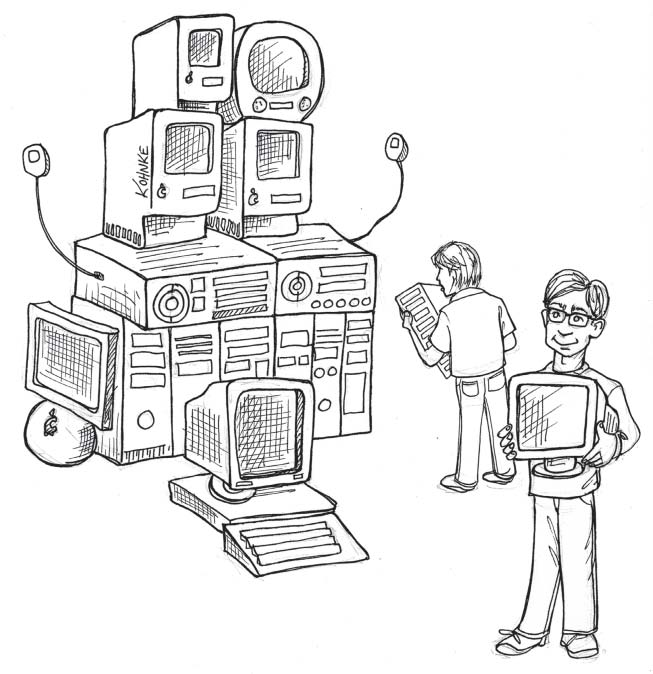
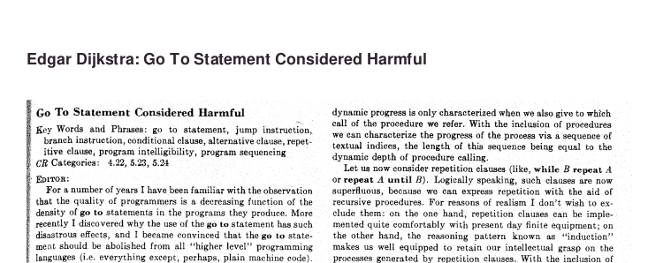
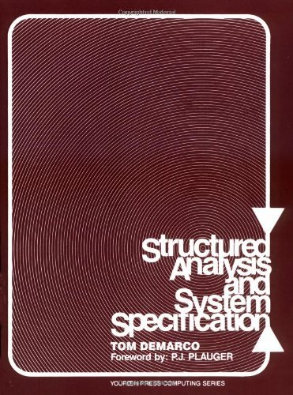
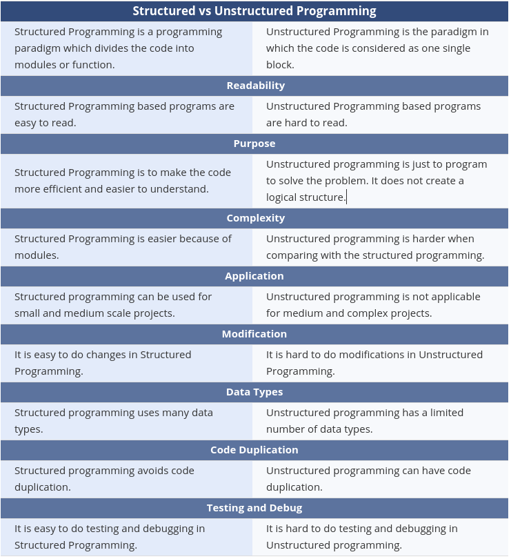

# Fundamentals of Software Architecture: Extra Topics I

**Author:** Kaan Keskin

Date: April 2021

Available at: https://github.com/kaan-keskin/software-architecture-notes

**Resources:**

- Clean Architecture - Robert C. Martin - 2018
- Software Architecture Lecture Notes - University of Alberta - 2017
- Code Complete 2 - Steve McConnell - 2009
- The Architecture Tradeoff Analysis Method - Rick Kazman, Mark Klein, Mario Barbacci, Tom Longstaff, Howard Lipson, Jeromy Carriere - Proceedings of ICECCS98 - July 1998
- Architectural Blueprints—The “4+1” View Model of Software Architecture from Philippe Kruchten - IEEE Software - November 1995
- [*A Case against the GO TO Statement (EWD-215)*](http://www.cs.utexas.edu/users/EWD/ewd02xx/EWD215.PDF) - Dijkstra, Edsger W. - 1968
- Letters to the editor: go to statement considered harmful - Edsger W. Dijkstra - [Communications of the ACM](https://dl.acm.org/magazine/cacm) - March 1968
- Flow diagrams, turing machines and languages with only two formation rules - Corrado Bohm, Giuseppe Jacopini - [Communications of the ACM](https://dl.acm.org/magazine/cacm) - May 1966

## Software Architecture Overview

**Software architecture is the fundamental design of an entire software system.** 

It defines what elements are included in the system, what function each element has, and how each element relates to one another.

**It is the big picture or overall structure of the whole system—how everything works together.**

It follows that to design a software system, a software architect has to take many factors into consideration:

- the purpose of the system,
- the audience or users of the system,
- the qualities that are of most importance to users, and
- where the system will run.

***Benefits:*** Software architecture is important, particularly for large systems. **If there is a clear design of the overall system from the start, there is a solid basis for developers to follow.** Each developer will then know what needs to be implemented and how things are related to meet desired needs efficiently. This avoids conflicts, duplication, and ad hoc unnecessary work.

**Some advantages of software architecture include:**

- **higher productivity** for the software team, as a well-defined structure helps to coordinate work, implement individual features, or guide discussions on potential issues.
- improved **evolution** for the software, since design principles are applied to make changes easier to accomplish or defects easier to find.
- enhanced **quality** in the software by carefully considering the needs and perspectives of all the stakeholders.

## Programming Paradigms

**Software architecture begins with the code**—and so we will begin our discussion of architecture by looking at what we’ve learned about code since code was first written.

**Probably more significant, revolution was in programming paradigms.**

**Paradigms are ways of programming, relatively unrelated to languages.**

**A paradigm tells you which programming structures to use, and when to use them.**


### Structured Programming

In the **1960s**, extensive use of control transfers was causing difficulty in software development. Blame was pointed at the **goto statement**. This statement allowed you to transfer control to one of many possible destinations in a program. 



In **1966**, Bohm and Jacopini’s research demonstrated that programs could be written without goto statements. Bohm and Jacopini demonstrated that **all programs could be written using three forms of control—namely, sequential execution, the selection statement and the repetition statement.** 


The first paradigm to be adopted (but not the first to be invented) was structured programming, which was discovered by **Edsger Wybe Dijkstra** in **1968**.

Dijkstra showed that the use of unrestrained jumps (**goto statements**) is harmful to program structure. He replaced those jumps with the more familiar **if/then/else** and **do/while/until** constructs.



**The notion of structured programming became almost synonymous with “goto elimination.”**

#### Unstructured Programming

**Unstructured Programming is a type of programming that generally executes in sequential order i.e., these programs just not jumped from any line of code and each line gets executed sequentially.**

It is also known as non-structured programming that is capable of creating turning-complete algorithms.

#### Structured Programming

**Structured Programming is a type of programming that generally converts large or complex programs into more manageable and small code of pieces.**

These small codes of pieces are usually known as **functions** or **modules** or **sub-programs** of large complex programs.

It is known as modular programming and minimizes the chances of function affecting another.

Structured programs are clearer, easier to debug and change, and more likely to be bug-free.

We can summarize the structured programming paradigm as follows:

- ***Structured programming imposes discipline on direct transfer of control.***


#### Functional Decomposition

**Structured programming allows modules to be recursively decomposed into provable units, which in turn means that modules can be functionally decomposed.**

That is, you can take a large-scale problem statement and decompose it into high-level functions. Each of those functions can then be decomposed into lower-level functions, ad infinitum. Moreover, each of those decomposed functions can be represented using the restricted control structures of structured programming.

Building on this foundation, disciplines such as structured analysis and structured design became popular in the late 1970s and throughout the 1980s. Men like Ed Yourdon, Larry Constantine, Tom DeMarco, and Meilir Page-Jones promoted and popularized these techniques throughout that period. By following these disciplines, programmers could break down large proposed systems into modules and components that could be further broken down into tiny provable functions.

Structured Analysis and System Specification, 1979 by Tom DeMarco:



#### Structured vs Unstructured Programming



Additional Information:

|Structured Programming | Unstructured Programming |
| ---- | ---- |
| It is basically a subset of procedural programs. | It is basically a procedural program. |
| In this, programmers are allowed to code a program simply by dividing the program into modules or smaller units. | In this, programmers are not allowed code divide programs into small units. Instead, the program should be written as a single continuous block without any breakage. |
| It is more user-friendly and easy to understand as compared to unstructured programming. | It is less user-friendly and little hard to understand as compared to structured programming. |
| It is easier to learn and follow. | 	It is difficult to learn and follow. |
| Its advantages include reduce complexity, facilitate debugging, increase programmer productivity programs, etc. | Its advantages include its speed. |
| Such programs can be used for small and medium-scale projects and also for complex projects. | Such programs cannot be used for medium and complex projects. Instead, they can be used for small and easier projects. |
| These programs do not allow code duplication. | These programs allow code duplication. |
| Structured programs use a greater number of data types as compared to unstructured programs. | Unstructured programs use a limited number of data types as compared to structured programs. |
| It does not use GOTO to control the flow of execution. Instead, it uses loops. | It uses GOTO to control the flow of execution. |
| It produces readable code. | 	It hardly produces readable code. |
| It does not provide full freedom to programmers to program as they want. | It provides full freedom to programmers to program as they want. |
| Languages: C, C+, C++, C#, Java, PERL, Ruby, PHP, ALGOL, Pascal, PL/I and Ada | Languages: Early versions of BASIC (such as MSX BASIC and GW-BASIC), JOSS, FOCAL, MUMPS, TELCOMP, COBOL, machine-level code, early assembler systems (without procedural metaoperators), assembler debuggers and some scripting languages such as MS-DOS batch file language. |

### Object-Oriented Programming

The second paradigm to be adopted was actually discovered two years earlier, in **1966**, by **Ole Johan Dahl** and **Kristen Nygaard**. 

These two programmers noticed that the function call stack frame in the ALGOL language could be moved to a heap, thereby allowing local variables declared by a function to exist long after the function returned. The function became a constructor for a class, the local variables became instance variables, and the nested functions became methods. This led inevitably to the discovery of polymorphism through the disciplined use of function pointers.


We can summarize the object-oriented programming paradigm as follows:

- ***Object-oriented programming imposes discipline on indirect transfer of control.***


#### What is Object Oriented?

There are many opinions and many answers to this question.

**To the software architect, however, the answer is clear: OO is the ability, through the use of polymorphism, to gain absolute control over every source code dependency in the system.**

It allows the architect to create a plugin architecture, in which modules that contain high-level policies are independent of modules that contain low-level details. The low-level details are relegated to plugin modules that can be deployed and developed independently from the modules that contain high-level policies.

The four principles of object-oriented programming are encapsulation, abstraction, inheritance, and polymorphism.

These words may sound scary for a junior developer. And the complex, excessively long explanations in Wikipedia sometimes double the confusion.

#### Encapsulation

The reason encapsulation is cited as part of the definition of OO is that OO languages provide easy and effective encapsulation of data and function. As a result, a line can be drawn around a cohesive set of data and functions. Outside of that line, the data is hidden and only some of the functions are known. We see this concept in action as the private data members and the public member functions of a class.

**Encapsulation is achieved when each object keeps its state private, inside a class. Other objects don’t have direct access to this state. Instead, they can only call a list of public functions — called methods.**

**So, the object manages its own state via methods — and no other class can touch it unless explicitly allowed. If you want to communicate with the object, you should use the methods provided. But (by default), you can’t change the state.**

#### Abstraction

Abstraction can be thought of as a natural extension of encapsulation.

In object-oriented design, programs are often extremely large. And separate objects communicate with each other a lot. So maintaining a large codebase like this for years — with changes along the way — is difficult.

Abstraction is a concept aiming to ease this problem.

**Applying abstraction means that each object should only expose a high-level mechanism for using it.**

**This mechanism should hide internal implementation details. It should only reveal operations relevant for the other objects.**

Think — a coffee machine. It does a lot of stuff and makes quirky noises under the hood. But all you have to do is put in coffee and press a button.

**Preferably, this mechanism should be easy to use and should rarely change over time. Think of it as a small set of public methods which any other class can call without “knowing” how they work.**

#### Inheritance

OK, we saw how encapsulation and abstraction can help us develop and maintain a big codebase.

But do you know what is another common problem in OOP design?

**Objects are often very similar. They share common logic. But they’re not entirely the same.**

So how do we reuse the common logic and extract the unique logic into a separate class? One way to achieve this is inheritance.

**It means that you create a (child) class by deriving from another (parent) class. This way, we form a hierarchy.**

**The child class reuses all fields and methods of the parent class (common part) and can implement its own (unique part).**

#### Polymorphism

**Polymorphism means “many shapes” in Greek.**

So we already know the power of inheritance and happily use it. But there comes this problem.

Say we have a parent class and a few child classes which inherit from it. Sometimes we want to use a collection — for example a list — which contains a mix of all these classes. Or we have a method implemented for the parent class — but we’d like to use it for the children, too.

This can be solved by using polymorphism.

**Simply put, polymorphism gives a way to use a class exactly like its parent so there’s no confusion with mixing types. But each child class keeps its own methods as they are.**

This typically happens by defining a (parent) interface to be reused. It outlines a bunch of common methods. Then, each child class implements its own version of these methods.

Any time a collection (such as a list) or a method expects an instance of the parent (where common methods are outlined), the language takes care of evaluating the right implementation of the common method — regardless of which child is passed.

#### Anti-patterns for Object Oriented Programming

[Goodbye, Object Oriented Programming, 2016](https://medium.com/@cscalfani/goodbye-object-oriented-programming-a59cda4c0e53)

**Inheritance:**

**There’s a great quote by Joe Armstrong, the creator of Erlang:**

```
The problem with object-oriented languages is they’ve got all this implicit environment that they carry around with them. You wanted a banana but what you got was a gorilla holding the banana and the entire jungle.
```

**Banana Monkey Jungle Solution**

I can tame this problem by not creating hierarchies that are too deep. But if Inheritance is the key to Reuse, then any limits I place on that mechanism will surely limit the benefits of Reuse. Right?

### Functional Programming

The third paradigm, which has only recently begun to be adopted, was the first to be invented. Indeed, its invention predates computer programming itself.


Functional programming is the direct result of the work of **Alonzo Church**, who in **1936** invented **lambda-calculus** while pursuing the same mathematical problem that was motivating Alan Turing at the same time.

His lambda-calculus is the foundation of the LISP language, invented in 1958 by John McCarthy.

**Lambda calculus is framework developed by Alonzo Church to study computations with functions. It can be called as the smallest programming language of the world.** It gives the definition of what is computable. Anything that can be computed by lambda calculus is computable. It is equivalent to Turing machine in its ability to compute. It provides a theoretical framework for describing functions and their evaluation. It forms the basis of almost all current functional programming languages.

***Fact: Alan Turing was a student of Alonzo Church who created Turing machine which laid the foundation of imperative programming style.***

**A foundational notion of lambda-calculus is immutability—that is, the notion that the values of symbols do not change. This effectively means that a functional language has no assignment statement. Most functional languages do, in fact, have some means to alter the value of a variable, but only under very strict discipline.**

Functional programming is a programming paradigm in which we try to bind everything in pure mathematical functions style. It is a declarative type of programming style. 

Its main focus is on “what to solve” in contrast to an imperative style where the main focus is “how to solve”. It uses expressions instead of statements. An expression is evaluated to produce a value whereas a statement is executed to assign variables.

**Functional programming** is a style of **programming** that emphasizes writing applications using only **pure functions** and **immutable values**.

In pure **functional programming** language you focus on writing pure functions. A **pure function’s** result depends only on the argument(s) you pass to it. Also, given a particular argument (or arguments), a pure function always produces the same result.

We can summarize the functional programming paradigm as follows:

- ***Functional programming imposes discipline upon assignment.***


#### Immutability and Architecture

Why is this point important as an architectural consideration? Why would an architect be concerned with the mutability of variables? 

**The answer is absurdly simple: All race conditions, deadlock conditions, and concurrent update problems are due to mutable variables.**

**You cannot have a race condition or a concurrent update problem if no variable is ever updated.**

**You cannot have deadlocks without mutable locks.**

**In other words, all the problems that we face in concurrent applications—all the problems we face in applications that require multiple threads, and multiple processors—cannot happen if there are no mutable variables.**

As an architect, you should be very interested in issues of concurrency. You want to make sure that the systems you design will be robust in the presence of multiple threads and processors. The question you must be asking yourself, then, is whether immutability is practicable.

The answer to that question is affirmative, if you have infinite storage and infinite processor speed. Lacking those infinite resources, the answer is a bit more nuanced. Yes, immutability can be practicable, if certain compromises are made.

Immutable types are safer from bugs, easier to understand, and more ready for change. Mutability makes it harder to understand what your program is doing, and much harder to enforce contracts.

Some of those compromises:

- **Segregation of Mutability**: 

  One of the most common compromises in regard to immutability is to segregate the application, or the services within the application, into mutable and immutable components. 

  The immutable components perform their tasks in a purely functional way, without using any mutable variables. The immutable components communicate with one or more other components that are not purely functional, and allow for the state of variables to be mutated.

  

  Since mutating state exposes those components to all the problems of concurrency, it is common 	practice to use some kind of transactional memory to protect the mutable variables from concurrent updates and race conditions.

  Transactional memory simply treats variables in memory the same way a database treats records on disk. It protects those variables with a transaction- or retry-based scheme.

  The point is that well-structured applications will be segregated into those components that do not mutate variables and those that do. This kind of segregation is supported by the use of appropriate disciplines to protect those mutated variables.

  Architects would be wise to push as much processing as possible into the immutable components, and to drive as much code as possible out of those components that must allow mutation.

- **Event Sourcing:** 

  The limits of storage and processing power have been rapidly receding from view. Nowadays it is common for processors to execute billions of instructions per second and to have billions of bytes of RAM. **The more memory we have, and the faster our machines are, the less we need mutable state.** 

  **Event sourcing is a strategy wherein we store the transactions, but not the state. When state is required, we simply apply all the transactions from the beginning of time.**

  Of course, we can take shortcuts. For example, we can compute and save the state every midnight. Then, when the state information is required, we need compute only the transactions since midnight.

  Now consider the data storage required for this scheme: We would need a lot of it. Realistically, offline data storage has been growing so fast that we now consider trillions of bytes to be small—so we have a lot of it.

  More importantly, nothing ever gets deleted or updated from such a data store. **As a consequence, our applications are not CRUD; they are just CR.** Also, because neither updates nor deletions occur in the data store, there cannot be any concurrent update issues.

  **If we have enough storage and enough processor power, we can make our applications entirely immutable—and, therefore, entirely functional.**

  If this still sounds absurd, it might help if you remembered that this is precisely the way your source code control system works.

### Conclusion

To summarize:

- Structured programming is discipline imposed upon direct transfer of control.

- Object-oriented programming is discipline imposed upon indirect transfer of control.

- Functional programming is discipline imposed upon variable assignment.

Each of these three paradigms has taken something away from us. Each restricts some aspect of the way we write code. None of them has added to our power or our capabilities.

**What we have learned over the last half-century is what not to do.**

**With that realization, we have to face an unwelcome fact: Software is not a rapidly advancing technology.** 

The rules of software are the same today as they were in 1946, when Alan Turing wrote the very first code that would execute in an electronic computer. The tools have changed, and the hardware has changed, but the essence of software remains the same. 

**Software—the stuff of computer programs—is composed of sequence, selection, iteration, and indirection. Nothing more. Nothing less.**

## Kruchten’s 4+1 View Model


**Kruchten's 4+1 View Model** presents a model for describing the architecture of software-intensive systems, based on the use of multiple, concurrent views. 

**This use of multiple views allows to address separately the concerns of the various ‘stakeholders’ of the architecture: end-user, developers, systems engineers, project managers, etc., and to handle separately the functional and non-functional requirements.** 

Each of the five views is described, together with a notation to capture it. The views are designed using an architecture-centered, scenario-driven, iterative development process.

**We all have seen many books and articles where one diagram attempts to capture the gist of the architecture of a system. But looking carefully at the set of boxes and arrows shown on these diagrams, it becomes clear that their authors have struggled hard to represent more on one blueprint than it can actually express.**

### An Architectural Model

**Software architecture deals with the design and implementation of the high-level structure of the software.** 

It is the result of assembling a certain number of architectural elements in some well-chosen forms to satisfy the major functionality and performance requirements of the system, as well as some other, non-functional requirements such as reliability, scalability, portability, and availability.

**Software architecture deals with abstraction, with decomposition and composition, with style and aesthetics.**

**To describe a software architecture, we use a model composed of multiple views or perspectives.**

 In order to eventually address large and challenging architectures, the model we propose is made up of five main views:

- **The logical view**, which is the object model of the design (when an object-oriented design method is
  used),
- **The process view**, which captures the concurrency and synchronization aspects of the design,
- **The physical view**, which describes the mapping(s) of the software onto the hardware and reflects its
  distributed aspect,
- **The development view**, which describes the static organization of the software in its development
  environment.

The description of an architecture—the decisions made—can be organized around these four views, and
then illustrated by a few selected use cases, or scenarios which become a fifth view.


### The Logical Architecture

*The Object-Oriented Decomposition*

**The logical architecture primarily supports the functional requirements—what the system should provide in terms of services to its users.**

The system is decomposed into a set of key abstractions, taken (mostly) from the problem domain, in the form of objects or object classes. They exploit the principles of abstraction, encapsulation, and inheritance. This decomposition is not only for the sake of functional analysis, but also serves to identify common mechanisms and design elements across the various parts of the system.

Mapping to UML 2 Diagrams:

- Class Diagram
- Object Diagram
- Package Diagram
- Composite Structure Diagram
- State Machine Diagram

### The Process Architecture

*The Process Decomposition*

**The process view presents processes that correspond to the objects in the logical view.**

**The process architecture takes into account some non-functional requirements, such as performance and availability.** It addresses issues of concurrency and distribution, of system’s integrity, of fault-tolerance, and **how the main abstractions from the logical view fit within the process architecture**—on which thread of control is an operation for an object actually executed.

**The process architecture can be described at several levels of abstraction, each level addressing different concerns.**

At the highest level, the process architecture can be viewed as a set of independently executing logical networks of communicating programs (called “processes”), distributed across a set of hardware resources connected by a LAN or a WAN. Multiple logical networks may exist simultaneously, sharing the same physical resources. 

**A process is a grouping of tasks that form an executable unit.** 

Processes represent the level at which the process architecture can be tactically controlled (i.e., started, recovered, reconfigured, and shut down). In addition, processes can be replicated for increased distribution  of the processing load, or for improved availability.

**The software is partitioned into a set of independent tasks.**

**A task is a separate thread of control, that can be scheduled individually on one processing node.**

We can distinguish then: major tasks, that are the architectural elements that can be uniquely addressed and minor tasks, that are additional tasks introduced locally for implementation reasons (cyclical activities, buffering, time-outs, etc.).

Mapping to UML 2 Diagrams:

- Sequence Diagram
- Communication Diagram
- Activity Diagram
- Timing Diagram
- Interaction Overview

### The Development Architecture

*Subsystem decomposition*

**The development architecture focuses on the actual software module organization on the software development environment.**

**The development view describes the hierarchical software structure.**

It also considers elements such as programming language, libraries, and tool-sets. It is concerned with the details of software development and what is involved to support that. This extends to management details such as scheduling, budgets, and work assignments. Essentially, the development view covers the hierarchical software structure and project management.

The software is packaged in small chunks—program libraries, or subsystems— that can be developed by one or a small number of developers. The subsystems are organized in a hierarchy of layers, each layer providing a narrow and well-defined interface to the layers above it.

The development architecture of the system is represented by module and subsystem diagrams, showing the ‘export’ and ‘import’ relationships. The complete development architecture can only be described when all the elements of the software have been identified. It is, however, possible to list the rules that govern the development architecture: partitioning, grouping, visibility.

**For the most part, the development architecture takes into account internal requirements related to the ease of development, software management, reuse or commonality, and to the constraints imposed by the tool-set, or the programming language.**

The development view serves as the basis for requirement allocation, for allocation of work to teams (or even for team organization), for cost evaluation and planning, for monitoring the progress of the project, for reasoning about software reuse, portability and security. 

**It is the basis for establishing a line-of-product.**

Mapping to UML 2 Diagrams:

- Component diagram
- Package diagram

### The Physical Architecture

*Mapping the software to the hardware*

**The physical architecture takes into account primarily the non-functional requirements of the system such as availability, reliability (fault-tolerance), performance (throughput), and scalability.**

**The physical view handles how elements in the logical, process, and development views must be mapped to different nodes or hardware for running the system.**

The software executes on a network of computers, or processing nodes (or just nodes for short). The various elements identified— networks, processes, tasks, and objects—need to be mapped onto the various nodes.

We expect that several different physical configurations will be used: some for development and testing, others for the deployment of the system for various sites or for different customers. 

The mapping of the software to the nodes therefore needs to be highly flexible and have a minimal impact on the source code itself.

Mapping to UML 2 Diagrams:

- Deployment Diagram

### Scenarios

*Putting it all together*

**Scenarios align with the use cases or user tasks of a system and show how the four other views work together.**

**The elements in the four views are shown to work together seamlessly by the use of a small set of important scenarios** —instances of more general use cases—for which we describe the corresponding scripts (sequences of interactions between objects, and between processes).

**For each scenario, there is a script that describes the sequence of interactions between objects and processes.** 

This involves the key objects defined in the logical view, the processes described in the process view, the hierarchy identified in the development view, and the different nodes specified in the physical view. Scenarios relate these elements to provide a complete picture.

**The scenarios are in some sense an abstraction of the most important requirements. **

Their design is expressed using object scenario diagrams and object interaction diagrams. This view is redundant with the other ones (hence the “+1”), but it serves two main purposes:

- as a driver to discover the architectural elements during the architecture design.
- as a validation and illustration role after this architecture design is complete, both on paper and as the
  starting point for the tests of an architectural prototype.

Mapping to UML 2 Diagrams:

- Use Case Diagram
- Activity Diagram

***None of the views are fully independent of each other, with elements of some views connected to others. The 4+1 view model can be molded to fit many situations to understand the architecture of a software system. Being able to see a complex problem in many different perspectives helps make your software more versatile.***

