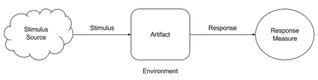

# Fundamentals of Software Architecture: Extra Topics II

**Author / Collector Agent:** Kaan Keskin

**Resources:**

- Clean Architecture - Robert C. Martin - 2018
- Software Architecture Lecture Notes - University of Alberta - 2017
- Code Complete 2 - Steve McConnell - 2009
- The Architecture Tradeoff Analysis Method - Rick Kazman, Mark Klein, Mario Barbacci, Tom Longstaff, Howard Lipson, Jeromy Carriere - Proceedings of ICECCS98 - July 1998
- Architectural Blueprints—The “4+1” View Model of Software Architecture from Philippe Kruchten - IEEE Software - November 1995
- [*A Case against the GO TO Statement (EWD-215)*](http://www.cs.utexas.edu/users/EWD/ewd02xx/EWD215.PDF) - Dijkstra, Edsger W. - 1968
- Letters to the editor: go to statement considered harmful - Edsger W. Dijkstra - [Communications of the ACM](https://dl.acm.org/magazine/cacm) - March 1968
- Flow diagrams, turing machines and languages with only two formation rules - Corrado Bohm, Giuseppe Jacopini - [Communications of the ACM](https://dl.acm.org/magazine/cacm) - May 1966

## Software Architecture Overview

**Software architecture is the fundamental design of an entire software system.** 

It defines what elements are included in the system, what function each element has, and how each element relates to one another.

**It is the big picture or overall structure of the whole system—how everything works together.**

It follows that to design a software system, a software architect has to take many factors into consideration:

- the purpose of the system,
- the audience or users of the system,
- the qualities that are of most importance to users, and
- where the system will run.

***Benefits:*** Software architecture is important, particularly for large systems. **If there is a clear design of the overall system from the start, there is a solid basis for developers to follow.** Each developer will then know what needs to be implemented and how things are related to meet desired needs efficiently. This avoids conflicts, duplication, and ad hoc unnecessary work.

**Some advantages of software architecture include:**

- **higher productivity** for the software team, as a well-defined structure helps to coordinate work, implement individual features, or guide discussions on potential issues.
- improved **evolution** for the software, since design principles are applied to make changes easier to accomplish or defects easier to find.
- enhanced **quality** in the software by carefully considering the needs and perspectives of all the stakeholders.

## Analyzing and Evaluating an Architecture

In addition to designing a system, it is important to know how to evaluate the design to determine if it addresses the concerns, or the requirements, of all stakeholders. **Analyzing and evaluating software architecture can be difficult due to the abstract nature of software.**

**It is important to methodically analyze and evaluate a system’s behaviors, quality attributes, and various characteristics.** 

In order to measure quality attributes, **quality attribute scenarios** can be used to determine if a system is able to meet requirements set for the attribute. 

There are two kinds of scenarios:

- A **general scenario**, which is used to characterize any system
- A **concrete scenario**, which is used to characterize a specific system

Both general and concrete scenarios have:
- A **stimulus source**, which is anything that creates a stimulus. It can be internal or external to the system.
- A **stimulus** is a condition that will cause the system to respond. As the source of the condition can originate internally or externally, types of conditions will need to be differentiated.
- An **environment** is the mode of the system when it is receiving a stimulus. This is an important aspect, particularly if the system involves distributed computing, or if it can exist in operational modes besides just running and stopped, like recovering from a failure.
- An **artifact** is the part of the system that is affected by the stimulus. In large-scale systems, a stimulus should not directly affect the entire system.
- A **response** is how the artifact will behave as a result of receiving a stimulus. This response could include handling an error, recovering from a failure, updating system logs, dispatching security alerts, or changing the current environments.
- A **response measure** is a metric used to quantify the response so that the quality attribute can be measured. The metric should be quantitative and objective, such as probability of failure, response time, repair time, and average system load.

Scenarios are built to identify situations that impact the quality attributes of a system. In the context of analyzing and evaluating architecture, you should focus on situations that are outside of the normal execution path. This means that scenarios involving incorrect input, heavy system loads, or potential security breaches should be prioritized highly.

It is a system’s “inability” to handle unexpected failures that stops it from achieving a specific quality attribute.

